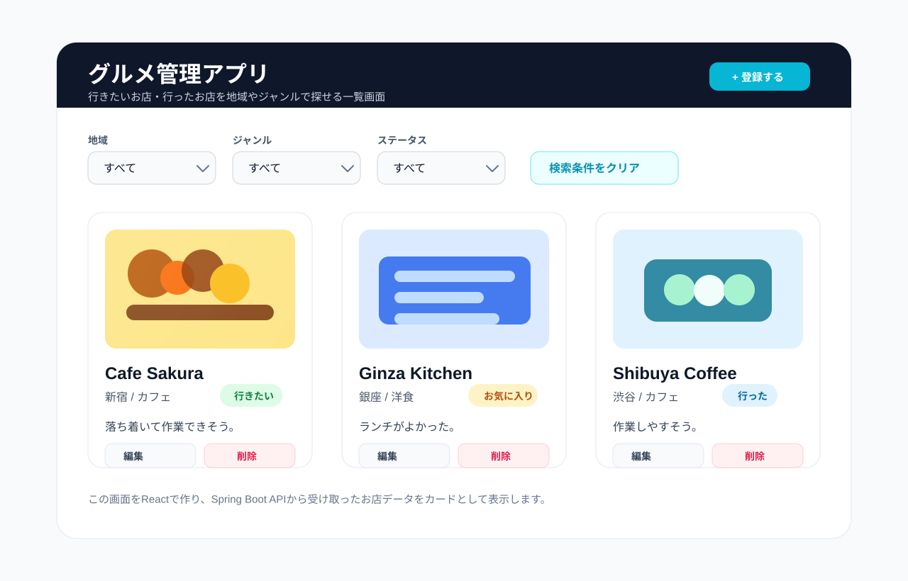

# Day 1: Webアプリの全体像

## 今日のゴール

- ブラウザ、React、API、Spring Boot、DBの関係を理解する
- HTTPリクエストとHTTPレスポンスの流れを説明できる
- JSONがどこで使われるかを理解する
- REST APIの基本を知る
- グルメ管理アプリの画面、データ、APIをざっくり設計できる
- AIで実装する前に、何を作るのかを言葉と図で説明できる

## 扱う内容

- Webアプリケーションの全体像
- フロントエンドとバックエンドの役割
- 今回作るグルメ管理アプリの完成イメージ
- HTTPメソッド
- URLとエンドポイント
- JSON
- REST API
- 画像URLを使った画像表示の考え方

## ライブコーディングと演習

```text
ライブで見る題材  Movie
演習で考える題材  Restaurant
```

Day1ではコードを作り込まず、Movieを例に画面操作、API、JSONの関係を見ます。
その後、Restaurantに置き換えて、同じ構造で画面操作とAPIを整理します。

## 進める順番

```text
1. 今日作るグルメ管理アプリの完成イメージを見る
2. ブラウザ、React、Spring Boot、DBの役割を図で確認する
3. HTTPリクエスト、HTTPレスポンス、JSONを確認する
4. 画面操作とAPIの対応を考える
5. グルメ管理アプリの画面、データ、APIを設計する
6. 実装前に必要な仕様を文章にする
7. 演習の進め方と確認ポイントを確認する
```

Day1では、コードをたくさん書くよりも「これから何を作るのか」を言葉にできることを優先します。
ここが曖昧なまま実装すると、AIが作ったコードを見ても、何が正しいのか判断しにくくなります。

## 今日の大事な考え方

AIを使うとコードはすぐに作れるが、次のことが分からないと実務では詰まりやすい。

- 画面の処理なのか、APIの処理なのか
- データはどこから来て、どこに保存されるのか
- ボタンを押したときに、どのAPIが呼ばれるのか
- APIが返したJSONをReactがどう表示するのか

Day 1では、コードを書き始める前にこの地図を作る。


この図では、左から右に向かって処理の流れを見ます。

```text
ユーザー -> ブラウザ -> React -> Spring Boot -> データベース
```

まず覚えることは、ReactがDBを直接触らないことです。
ReactはSpring BootのAPIを呼び、Spring BootがDBとやり取りします。

## 最初に伝えること

Webアプリ開発では、いきなりコードを書き始めるより先に「役割分担」を理解することが大事。

今回のアプリは、画面、API、DBが分かれている。

```text
React        ユーザーが見る画面
Spring Boot  画面から呼ばれるAPI
DB           お店データを保存する場所
```

この3つは別々の役割を持っている。
最初に混乱しやすいのは、画面の問題なのか、APIの問題なのか、DBの問題なのかが分からなくなること。

Day 1では、まず「どこで何が起きているか」を見分ける力をつける。

## 用語の整理

### フロントエンド

ユーザーが直接見る部分。

今回でいうとReactで作る画面。
ボタン、入力フォーム、お店カード、フィルタなどがここに入る。

```text
ユーザーが操作する場所 = フロントエンド
```

### バックエンド

画面から呼ばれて、データの登録・取得・更新・削除を行う部分。

今回でいうとSpring Bootで作るAPI。
Reactから送られてきたリクエストを受け取り、必要に応じてDBへアクセスする。

```text
画面の裏側で処理する場所 = バックエンド
```

### API

フロントエンドとバックエンドの窓口。

ReactはDBを直接触らない。
ReactはSpring BootのAPIを呼び、Spring BootがDBとやり取りする。

```text
React -> API -> Spring Boot -> DB
```


ReactからSpring Bootへ送るものをHTTPリクエスト、Spring BootからReactへ返るものをHTTPレスポンスと呼びます。
レスポンスの中身はJSONとして返します。

### JSON

フロントエンドとバックエンドの間でデータをやり取りする形式。

JavaScriptのオブジェクトに似た見た目をしている。
ReactもSpring Bootも、このJSONを使ってデータを受け渡しする。

```json
{
  "name": "Cafe Sakura",
  "area": "新宿",
  "genre": "カフェ"
}
```

### REST API

URLとHTTPメソッドを使って、データに対する操作を表すAPIの考え方。

```text
GET     データを見る
POST    データを作る
PUT     データを更新する
DELETE  データを削除する
```

まずはこの4つだけ分かれば十分。

## 作るアプリ

行きたいお店や行ったお店を登録し、地域・ジャンル・ステータスで探しやすくするグルメ管理アプリを作る。

イメージとしては、「今度行きたいお店」「行ってよかったお店」「お気に入りのお店」をメモしておくサイトです。
お店の名前だけではなく、地域、ジャンル、メモ、画像、ステータスを一緒に残しておきます。

```text
今度ここ行きたい
  -> 行きたいステータスで登録する

ランチがよかった
  -> お気に入りステータスで残す

作業しやすかった
  -> メモと一緒に保存する
```

このアプリを作ることで、一覧表示、登録、編集、削除、絞り込み、画像表示というWebアプリの基本をまとめて練習できます。

最初に扱う項目:

- 店名
- 地域
- ジャンル
- メモ
- 画像URL
- ステータス

ステータス:

- 行きたい
- 行った
- お気に入り

画像はファイルをアップロードせず、画像URLを文字列として保存する。

```text
DBに画像URLを保存する
APIで画像URLを返す
Reactが  で画像を表示する
```

## 画面の完成イメージ



最初にこの画面を見せて、「こういうサイトを作る」と共有します。
行きたいお店をカードとして登録しておき、あとから地域、ジャンル、ステータスで探せる画面です。

この画面では、次の要素を作ります。

- 地域、ジャンル、ステータスのフィルタ
- お店の画像
- 店名
- 地域とジャンル
- ステータス
- メモ
- 編集、削除の操作

最初は見た目を完全に再現する必要はありません。
大事なのは、画面に表示するデータとAPIで返すデータが対応していることです。

## データの完成イメージ

APIからReactへ返すデータは、JSONという形になります。
このJSONのキーが、Reactで画面に表示するときのプロパティ名になります。

```json
{
  "id": 1,
  "name": "Cafe Sakura",
  "area": "新宿",
  "genre": "カフェ",
  "memo": "落ち着いて作業できそう",
  "imageUrl": "https://example.com/cafe.jpg",
  "status": "WANT_TO_GO"
}
```

各項目の意味:

```text
id
  お店を区別する番号。
  編集、削除、詳細表示で「どのお店か」を指定するときに使う。

name
  店名。
  Reactでは restaurant.name のように取り出して表示する。

area
  地域。
  画面の表示にも、地域フィルタにも使う。

genre
  ジャンル。
  カフェ、和食、洋食など。

memo
  お店に関するメモ。

imageUrl
  画像URL。
  Reactでは img タグの src に渡す。

status
  行きたい、行った、お気に入りなどの状態。
```

画面との対応:

```text
JSONの name      -> 画面の店名
JSONの area      -> 画面の地域
JSONの genre     -> 画面のジャンル
JSONの memo      -> 画面のメモ
JSONの imageUrl  -> 画面の画像
JSONの status    -> 画面のステータス
```

## APIの完成イメージ

APIは「画面から何をしたいか」に対応して作ります。

```text
GET    /api/restaurants
GET    /api/restaurants/{id}
POST   /api/restaurants
PUT    /api/restaurants/{id}
DELETE /api/restaurants/{id}
```

フィルタ:

```text
GET /api/restaurants?area=新宿
GET /api/restaurants?genre=カフェ
GET /api/restaurants?status=WANT_TO_GO
```

それぞれの意味:

```text
GET /api/restaurants
  お店一覧を取得する。
  一覧画面を開いたときに使う。

GET /api/restaurants/{id}
  お店1件を取得する。
  {id} には 1 や 2 などのお店IDが入る。

POST /api/restaurants
  お店を新しく登録する。
  登録フォームの内容をJSONで送る。

PUT /api/restaurants/{id}
  既存のお店を更新する。
  {id} で更新対象のお店を指定する。

DELETE /api/restaurants/{id}
  お店を削除する。
  {id} で削除対象のお店を指定する。

GET /api/restaurants?area=新宿
  地域が新宿のお店だけを取得する。
  ?area=新宿 の部分をクエリパラメータと呼ぶ。
```

## API設計の考え方

画面でやりたい操作からAPIを考える。


```text
お店一覧を見たい
  -> GET /api/restaurants

お店を1件詳しく見たい
  -> GET /api/restaurants/{id}

お店を登録したい
  -> POST /api/restaurants

お店を編集したい
  -> PUT /api/restaurants/{id}

お店を削除したい
  -> DELETE /api/restaurants/{id}
```

最初はURLを暗記する必要はない。
大事なのは「画面操作」と「API」が対応していることを理解すること。

## Controllerのコードを先に見る

Day1ではまだ実装しません。
ただし、APIのURLがSpring BootのControllerコードにどう対応するかを先に見ておくと、Day2以降の理解が楽になります。

```java
@RestController
@RequestMapping("/api/restaurants")
public class RestaurantController {

    private final RestaurantService restaurantService;

    public RestaurantController(RestaurantService restaurantService) {
        this.restaurantService = restaurantService;
    }

    @GetMapping
    public List<RestaurantResponse> findAll() {
        return restaurantService.findAll();
    }

    @GetMapping("/{id}")
    public RestaurantResponse findById(@PathVariable Long id) {
        return restaurantService.findById(id);
    }

    @PostMapping
    public RestaurantResponse create(@RequestBody RestaurantRequest request) {
        return restaurantService.create(request);
    }

    @PutMapping("/{id}")
    public RestaurantResponse update(
            @PathVariable Long id,
            @RequestBody RestaurantRequest request
    ) {
        return restaurantService.update(id, request);
    }

    @DeleteMapping("/{id}")
    public void delete(@PathVariable Long id) {
        restaurantService.delete(id);
    }
}
```

今は全部を理解しなくて大丈夫です。
まず、URLとControllerの対応だけ見ます。

```text
@RequestMapping("/api/restaurants")
  このControllerで扱うAPIの基本URL。

private final RestaurantService restaurantService;
  実際の処理をServiceへ任せるために持っている。

public RestaurantController(RestaurantService restaurantService)
  Spring BootがRestaurantServiceを渡してくれる。

@GetMapping
  GET /api/restaurants に対応する。

@GetMapping("/{id}")
  GET /api/restaurants/1 のようなURLに対応する。

@PostMapping
  POST /api/restaurants に対応する。

@PutMapping("/{id}")
  PUT /api/restaurants/1 のようなURLに対応する。

@DeleteMapping("/{id}")
  DELETE /api/restaurants/1 のようなURLに対応する。
```

Controllerで覚えること:

```text
URLとHTTPメソッドを受け取る
細かい処理はServiceに任せる
Reactへ返すデータはResponse DTOにする
Reactから受け取るデータはRequest DTOにする
```

## Day1ハンズオン: MovieをRestaurantへ置き換える

Day1のハンズオンでは、新しい機能を考えません。
Movieの例で見た構造を、Restaurantへ置き換えます。

目的は、自由に設計することではなく、次の対応を理解することです。

```text
画面に表示する項目
  ↓
JSONのキー
  ↓
APIのURL
  ↓
Controllerのメソッド
```

### 1. Movieの例を確認する

まず、ライブでMovieの構造を見ます。

```text
映画一覧を見る
  -> GET /api/movies

映画を登録する
  -> POST /api/movies
```

MovieのJSON:

```json
{
  "id": 1,
  "title": "The Matrix",
  "genre": "SF",
  "memo": "仮想世界を扱う映画",
  "imageUrl": "https://example.com/matrix.jpg",
  "status": "WATCHED"
}
```

MovieのController対応:

```text
GET /api/movies
  -> @GetMapping

POST /api/movies
  -> @PostMapping
```

### 2. Restaurantに置き換える

Movieで見た名前をRestaurantへ置き換えます。

```text
Movie       -> Restaurant
movies      -> restaurants
title       -> name
/api/movies -> /api/restaurants
```

### 3. Restaurantの表示項目を埋める

画面に表示する項目と、JSONのキーを対応させます。

```text
画像          -> imageUrl
店名          -> name
地域          -> area
ジャンル      -> genre
メモ          -> memo
ステータス    -> status
```

### 4. RestaurantのAPI対応を埋める

Day1では、まず一覧表示と登録だけを対応させます。

```text
お店一覧を見る
  -> GET /api/restaurants
  -> @GetMapping

お店を登録する
  -> POST /api/restaurants
  -> @PostMapping
```

編集、削除、フィルタは後続Dayで扱います。
Day1の演習では、説明していないAPIを追加しません。

### 5. RestaurantのJSONを書く

MovieのJSONを参考にして、RestaurantのJSONを書きます。

```json
{
  "id": 1,
  "name": "Cafe Sakura",
  "area": "新宿",
  "genre": "カフェ",
  "memo": "落ち着いて作業できそう",
  "imageUrl": "https://example.com/cafe.jpg",
  "status": "WANT_TO_GO"
}
```

### Day1の完成ライン

次の4つを説明できればOKです。

```text
1. MovieとRestaurantの置き換え
2. 画面項目とJSONキーの対応
3. 一覧表示と登録のAPI
4. APIとControllerアノテーションの対応
```

## 画像URLの扱い

画像は `imageUrl` という文字列として扱います。
ReactはそのURLを `img` タグに渡して画像を表示します。

```jsx

```

## 図で確認すること

- ブラウザ -> React -> API -> Spring Boot -> DB の全体図
- HTTPリクエスト / レスポンスの往復図
- JSONデータが画面に表示されるまでの流れ

## 全体の流れ

全体図:

```text
ユーザー
  ↓ 操作する
ブラウザ
  ↓ 画面を表示する
React
  ↓ HTTPでAPIを呼ぶ
Spring Boot
  ↓ 必要に応じてDBへアクセスする
DB
```

## BrunoでAPIとJSONを見る

Day1の最後に、BrunoでAPIを直接呼び出して、JSONが返るところを見ます。

ここではReactの画面はまだ作りません。
Reactがあとで呼ぶことになるAPIを、先にBrunoで確認します。

見たい流れ:

```text
React
  ↓ APIを呼ぶ
Spring Boot API
  ↓ JSONを返す
React
  ↓ JSONを画面に表示する
```

Brunoでは、このうち次の部分を確認します。

```text
APIを呼ぶ
  ↓
JSONが返る
```

### Brunoで送るリクエスト

```http
GET http://localhost:8080/api/restaurants
```

見るポイント:

```text
GET
  データを取得するHTTPメソッド。

http://localhost:8080
  自分のPCで起動しているSpring Bootの場所。

/api/restaurants
  お店一覧を取得するAPIのURL。
```

### Brunoで返ってくるJSONの例

```json
[
  {
    "id": 1,
    "name": "Cafe Sakura",
    "area": "新宿",
    "genre": "カフェ",
    "memo": "落ち着いて作業できそう",
    "imageUrl": "https://example.com/cafe.jpg",
    "status": "WANT_TO_GO"
  }
]
```

見るポイント:

```text
[]
  複数のお店を返すため、配列になっている。

{}
  1件分のお店データ。

"name": "Cafe Sakura"
  JSONのキーと値。
  Reactでは restaurant.name のように取り出して表示する。

"imageUrl": "https://example.com/cafe.jpg"
  Reactでは imgタグのsrcに渡して画像を表示する。
```

### Bruno実演で確認すること

- APIはURLで呼び出す
- APIはJSONを返す
- ReactはこのJSONを受け取って画面に表示する
- JSONのキー名とReactで使うプロパティ名は対応する

この実演を見てからDay2に進むと、「なぜSpring BootでJSONを返すAPIを作るのか」が分かりやすくなります。

## ハンズオン

まだコードを書き始めません。
Movieの例を見たあと、同じ構造でRestaurantの設計ワークシートを埋めます。

目的は、Day2以降に作るAPIや画面の地図を先に作ることです。

### 1. Movieの例を見る

まずMovie題材で、画面操作、API、JSONの対応を見ます。

```text
映画一覧を見る    GET  /api/movies
映画を登録する    POST /api/movies
```

MovieのJSON:

```json
{
  "id": 1,
  "title": "The Matrix",
  "genre": "SF",
  "memo": "仮想世界を扱う映画",
  "imageUrl": "https://example.com/matrix.jpg",
  "status": "WATCHED"
}
```

見るポイント:

```text
画面に表示する項目
  title, genre, memo, imageUrl, status

APIのURL
  /api/movies

Reactで使う形
  movie.title
  movie.genre
  movie.imageUrl
```

### 2. Restaurantへ置き換える

Movieで見た構造を、Restaurantに置き換えます。

```text
Movie       -> Restaurant
movies      -> restaurants
title       -> name
/api/movies -> /api/restaurants
```

### 3. Restaurantの画面項目を書く

完成画面に表示する項目を書きます。

```text
表示する項目:
- 画像
- 店名
- 地域
- ジャンル
- ステータス
- メモ
```

対応するJSONのキー:

```text
画像          imageUrl
店名          name
地域          area
ジャンル      genre
ステータス    status
メモ          memo
```

### 4. Restaurantの登録フォーム項目を書く

登録フォームで入力する項目を書きます。

```text
入力する項目:
- 店名
- 地域
- ジャンル
- メモ
- 画像URL
- ステータス
```

対応するJSONのキー:

```text
店名          name
地域          area
ジャンル      genre
メモ          memo
画像URL       imageUrl
ステータス    status
```

### 5. 画面操作とAPIの対応を書く

Day1では、まず一覧表示と登録を確実に対応させます。

```text
お店一覧を見る
  -> GET /api/restaurants

お店を登録する
  -> POST /api/restaurants
```

編集、削除、フィルタは後続Dayで扱います。
Day1では「APIは画面操作に対応している」と分かれば十分です。

### 6. RestaurantのJSONを書く

RestaurantのJSON例を自分で書きます。

```json
{
  "id": 1,
  "name": "Cafe Sakura",
  "area": "新宿",
  "genre": "カフェ",
  "memo": "落ち着いて作業できそう",
  "imageUrl": "https://example.com/cafe.jpg",
  "status": "WANT_TO_GO"
}
```

確認すること:

```text
画面に表示する項目とJSONのキーが対応している
登録フォームの項目とJSONのキーが対応している
GETとPOSTのAPI URLを説明できる
```

### 7. BrunoでAPIとJSONを見る

Spring Boot APIが用意されている場合は、Brunoで次のリクエストを送ります。

```http
GET http://localhost:8080/api/restaurants
```

まだAPIが存在しない場合は、Day2でこのAPIを作ることを確認します。

Day1で理解したいこと:

```text
ReactはAPIを呼ぶ
APIはJSONを返す
ReactはJSONを画面に表示する
```

### Day1の提出物

Day1の最後に、次の4つを書けていればOKです。

```text
1. Restaurantの画面項目
2. Restaurantの登録フォーム項目
3. 画面操作とAPIの対応
4. RestaurantのJSON例
```

## 今日の確認ポイント

- ReactはDBを直接触らない、と説明できる
- Spring BootはAPIを受け取り、必要に応じてDBへアクセスする、と説明できる
- JSONがReactとSpring Bootの間を流れるデータ形式だと説明できる
- BrunoでAPIを呼び、JSONレスポンスを見る流れを説明できる
- `GET`、`POST`、`PUT`、`DELETE` の大まかな意味を説明できる
- `imageUrl` を `img` タグで表示する考え方を説明できる

## よくある混乱

### Reactとブラウザは同じものですか

同じではない。

ブラウザはWebページを表示するアプリ。
Reactはブラウザ上で動く画面を作るためのライブラリ。

### APIとSpring Bootは同じものですか

同じではない。

Spring Bootはバックエンドを作るためのフレームワーク。
APIはReactから呼ばれる入口。
Spring Bootを使ってAPIを作る、という関係。

### JSONはDBですか

DBではない。

JSONはデータの受け渡し形式。
DBはデータを保存する場所。

## メモ

最初は用語を増やしすぎず、「画面」「処理」「データの保存場所」に分けて説明する。
