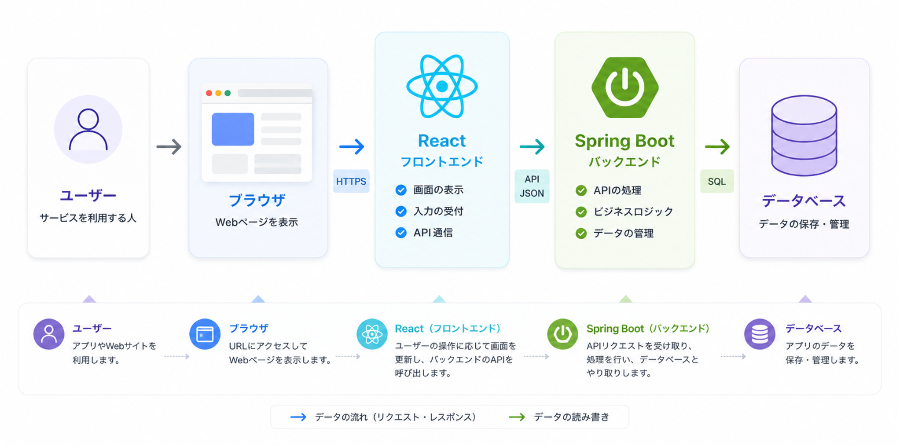
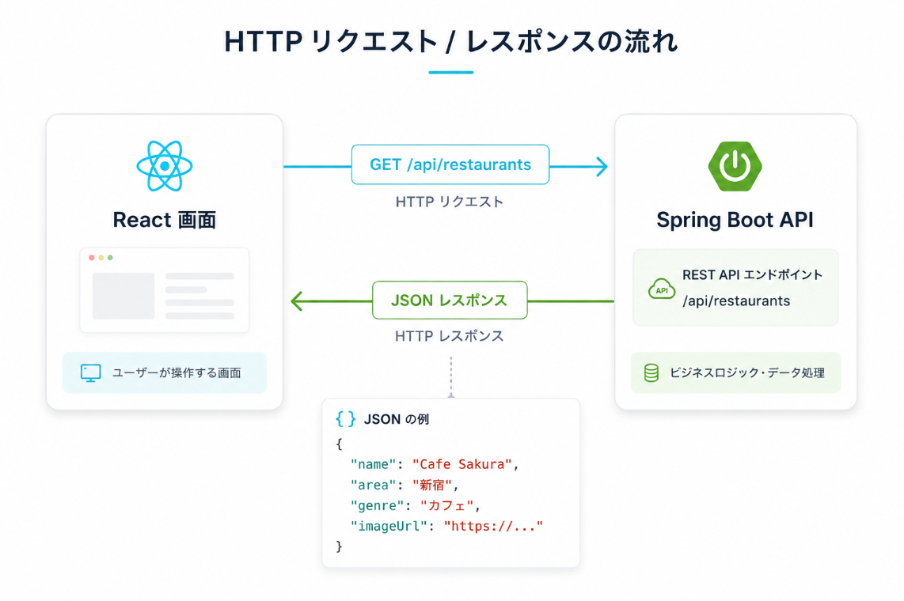
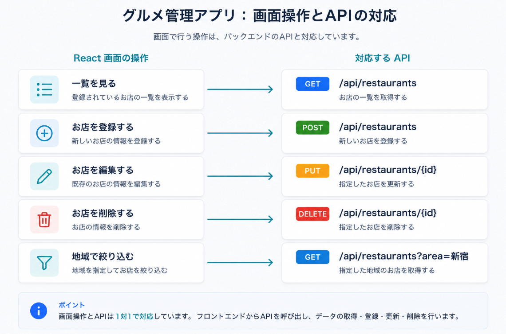

# Day 1: Webアプリの全体像

## 今日のゴール

- ブラウザ、React、API、Spring Boot、DBの関係を理解する
- HTTPリクエストとHTTPレスポンスの流れを説明できる
- JSONがどこで使われるかを理解する
- REST APIの基本を知る
- グルメ管理アプリの画面、データ、APIをざっくり設計できる
- AIで実装する前に、何を作るのかを言葉と図で説明できる

## 扱う内容

- Webアプリケーションの全体像
- フロントエンドとバックエンドの役割
- 今回作るグルメ管理アプリの完成イメージ
- HTTPメソッド
- URLとエンドポイント
- JSON
- REST API
- 画像URLを使った画像表示の考え方

## 3時間講義の流れ

```text
00:00-00:20  今日作るグルメ管理アプリの完成イメージを見る
00:20-00:50  ブラウザ、React、Spring Boot、DBの役割を図で確認する
00:50-01:20  HTTPリクエスト、HTTPレスポンス、JSONを確認する
01:20-01:50  画面操作とAPIの対応を考える
01:50-02:20  グルメ管理アプリの画面、データ、APIを設計する
02:20-02:45  AIに実装させる前に伝えるべき仕様を文章にする
02:45-03:00  演習の進め方と確認ポイントを共有する
```

Day1では、コードをたくさん書くよりも「これから何を作るのか」を言葉にできることを優先します。
ここが曖昧なまま実装すると、AIが作ったコードを見ても、何が正しいのか判断しにくくなります。

## 今日の大事な考え方

AIを使うとコードはすぐに作れるが、次のことが分からないと実務では詰まりやすい。

- 画面の処理なのか、APIの処理なのか
- データはどこから来て、どこに保存されるのか
- ボタンを押したときに、どのAPIが呼ばれるのか
- APIが返したJSONをReactがどう表示するのか

Day 1では、コードを書き始める前にこの地図を作る。



この図では、左から右に向かって処理の流れを見ます。

```text
ユーザー -> ブラウザ -> React -> Spring Boot -> データベース
```

まず覚えることは、ReactがDBを直接触らないことです。
ReactはSpring BootのAPIを呼び、Spring BootがDBとやり取りします。

## 最初に伝えること

Webアプリ開発では、いきなりコードを書き始めるより先に「役割分担」を理解することが大事。

今回のアプリは、画面、API、DBが分かれている。

```text
React        ユーザーが見る画面
Spring Boot  画面から呼ばれるAPI
DB           お店データを保存する場所
```

この3つは別々の役割を持っている。
最初に混乱しやすいのは、画面の問題なのか、APIの問題なのか、DBの問題なのかが分からなくなること。

Day 1では、まず「どこで何が起きているか」を見分ける力をつける。

## 用語の整理

### フロントエンド

ユーザーが直接見る部分。

今回でいうとReactで作る画面。
ボタン、入力フォーム、お店カード、フィルタなどがここに入る。

```text
ユーザーが操作する場所 = フロントエンド
```

### バックエンド

画面から呼ばれて、データの登録・取得・更新・削除を行う部分。

今回でいうとSpring Bootで作るAPI。
Reactから送られてきたリクエストを受け取り、必要に応じてDBへアクセスする。

```text
画面の裏側で処理する場所 = バックエンド
```

### API

フロントエンドとバックエンドの窓口。

ReactはDBを直接触らない。
ReactはSpring BootのAPIを呼び、Spring BootがDBとやり取りする。

```text
React -> API -> Spring Boot -> DB
```



ReactからSpring Bootへ送るものをHTTPリクエスト、Spring BootからReactへ返るものをHTTPレスポンスと呼びます。
レスポンスの中身はJSONとして返します。

### JSON

フロントエンドとバックエンドの間でデータをやり取りする形式。

JavaScriptのオブジェクトに似た見た目をしている。
ReactもSpring Bootも、このJSONを使ってデータを受け渡しする。

```json
{
  "name": "Cafe Sakura",
  "area": "新宿",
  "genre": "カフェ"
}
```

### REST API

URLとHTTPメソッドを使って、データに対する操作を表すAPIの考え方。

```text
GET     データを見る
POST    データを作る
PUT     データを更新する
DELETE  データを削除する
```

まずはこの4つだけ分かれば十分。

## 作るアプリ

行きたいお店や行ったお店を登録し、地域・ジャンル・ステータスで探しやすくするグルメ管理アプリを作る。

最初に扱う項目:

- 店名
- 地域
- ジャンル
- メモ
- 画像URL
- ステータス

ステータス:

- 行きたい
- 行った
- お気に入り

画像はファイルをアップロードせず、画像URLを文字列として保存する。

```text
DBに画像URLを保存する
APIで画像URLを返す
Reactが  で画像を表示する
```

## 画面の完成イメージ

```text
[地域: すべて] [ジャンル: すべて] [ステータス: すべて]

+-------------------------------+
| 画像                          |
| Cafe Sakura                   |
| 新宿 / カフェ / 行きたい       |
| 落ち着いて作業できそう         |
+-------------------------------+

+-------------------------------+
| 画像                          |
| Ginza Kitchen                 |
| 銀座 / 洋食 / お気に入り       |
| ランチがよかった               |
+-------------------------------+
```

## データの完成イメージ

```json
{
  "id": 1,
  "name": "Cafe Sakura",
  "area": "新宿",
  "genre": "カフェ",
  "memo": "落ち着いて作業できそう",
  "imageUrl": "https://example.com/cafe.jpg",
  "status": "WANT_TO_GO"
}
```

## APIの完成イメージ

```text
GET    /api/restaurants
GET    /api/restaurants/{id}
POST   /api/restaurants
PUT    /api/restaurants/{id}
DELETE /api/restaurants/{id}
```

フィルタ:

```text
GET /api/restaurants?area=新宿
GET /api/restaurants?genre=カフェ
GET /api/restaurants?status=WANT_TO_GO
```

## API設計の考え方

画面でやりたい操作からAPIを考える。



```text
お店一覧を見たい
  -> GET /api/restaurants

お店を1件詳しく見たい
  -> GET /api/restaurants/{id}

お店を登録したい
  -> POST /api/restaurants

お店を編集したい
  -> PUT /api/restaurants/{id}

お店を削除したい
  -> DELETE /api/restaurants/{id}
```

最初はURLを暗記する必要はない。
大事なのは「画面操作」と「API」が対応していることを理解すること。

## ライブ設計で一緒に作るもの

講義中に、次の3つを一緒に作ります。

### 1. 画面でできることの一覧

```text
お店一覧を見る
お店を登録する
お店を編集する
お店を削除する
地域で絞り込む
ジャンルで絞り込む
ステータスで絞り込む
```

### 2. データ項目の一覧

```text
id        お店を区別する番号
name      店名
area      地域
genre     ジャンル
memo      メモ
imageUrl  画像URL
status    行きたい、行った、お気に入り
```

### 3. 画面操作とAPIの対応表

```text
一覧を見る      GET    /api/restaurants
登録する        POST   /api/restaurants
編集する        PUT    /api/restaurants/{id}
削除する        DELETE /api/restaurants/{id}
地域で絞り込む  GET    /api/restaurants?area=新宿
```

この3つができると、AIに依頼するときも、実装後にコードを読むときも迷いにくくなります。

## 演習

自分で1つ機能を追加するつもりで、画面操作、データ項目、APIを考えます。

例:

```text
お気に入りだけ表示する
メモにキーワードを含むお店を探す
地域とジャンルを同時に指定して絞り込む
```

演習で書くもの:

- 画面で何をしたいか
- 必要なデータ項目
- 呼び出すAPI
- 返ってくるJSONの例

## AIに依頼する前に書く仕様

AIに実装を依頼するときは、次のように書ける状態を目指します。

```text
グルメ管理アプリを作ります。
お店には、店名、地域、ジャンル、メモ、画像URL、ステータスがあります。
一覧表示、登録、編集、削除、地域での絞り込みができるようにします。
Reactは画面を担当し、Spring BootはAPIを担当します。
APIは /api/restaurants 配下に作ります。
```

## 画像URL方式の考え方

今回、画像アップロードは扱わない。

画像アップロードを入れると、ファイル保存、容量制限、形式チェック、保存先、セキュリティなど考えることが急に増える。

そのため今回は、画像そのものではなく画像URLを保存する。

```text
保存するもの:
https://example.com/cafe.jpg

保存しないもの:
画像ファイル本体
```

ReactはこのURLを使って画像を表示する。

```jsx

```

この方式でも、一覧画面に画像付きカードを表示できるため、アプリらしさは十分出せる。

## 図で確認すること

- ブラウザ -> React -> API -> Spring Boot -> DB の全体図
- HTTPリクエスト / レスポンスの往復図
- JSONデータが画面に表示されるまでの流れ
- 画像URLが画面に表示されるまでの流れ

## 全体の流れ

全体図:

```text
ユーザー
  ↓ 操作する
ブラウザ
  ↓ 画面を表示する
React
  ↓ HTTPでAPIを呼ぶ
Spring Boot
  ↓ 必要に応じてDBへアクセスする
DB
```

画像URLの流れ:

```text
DB: image_url = "https://example.com/cafe.jpg"
  ↓
Spring Boot API: imageUrlとしてJSONに入れて返す
  ↓
React: restaurant.imageUrlを受け取る
  ↓
imgタグ: 
  ↓
ブラウザ: 画像を表示する
```

## ハンズオン

まだコードを書き始めず、完成するアプリの画面、データ、APIを設計する。

やること:

- 画面に表示したい項目を決める
- 登録フォームに必要な項目を決める
- APIの一覧を確認する
- JSONの形を読む
- フロントエンドとバックエンドの境界を確認する
- AIに実装を依頼するとしたら、どんな指示を出すか考える

## 今日の確認ポイント

- ReactはDBを直接触らない、と説明できる
- Spring BootはAPIを受け取り、必要に応じてDBへアクセスする、と説明できる
- JSONがReactとSpring Bootの間を流れるデータ形式だと説明できる
- `GET`、`POST`、`PUT`、`DELETE` の大まかな意味を説明できる
- 画像URL方式で画像が表示される流れを説明できる

## よくある混乱

### Reactとブラウザは同じものですか

同じではない。

ブラウザはWebページを表示するアプリ。
Reactはブラウザ上で動く画面を作るためのライブラリ。

### APIとSpring Bootは同じものですか

同じではない。

Spring Bootはバックエンドを作るためのフレームワーク。
APIはReactから呼ばれる入口。
Spring Bootを使ってAPIを作る、という関係。

### JSONはDBですか

DBではない。

JSONはデータの受け渡し形式。
DBはデータを保存する場所。

## メモ

最初は用語を増やしすぎず、「画面」「処理」「データの保存場所」に分けて説明する。
