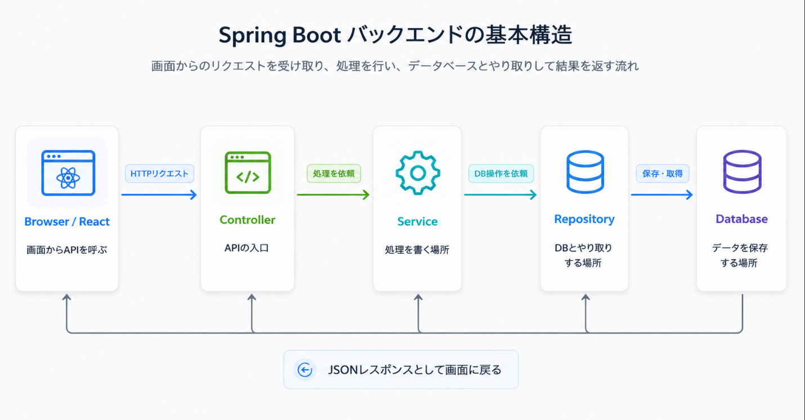
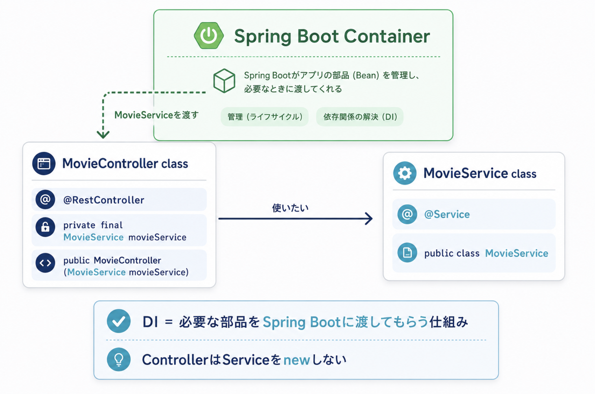
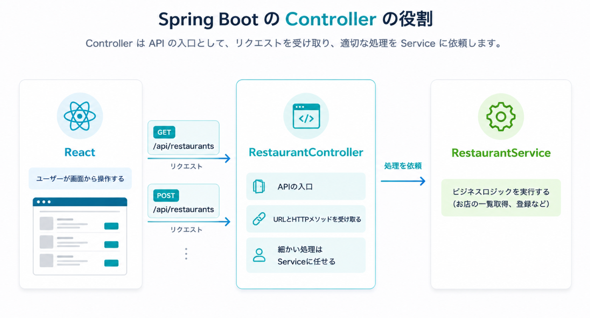
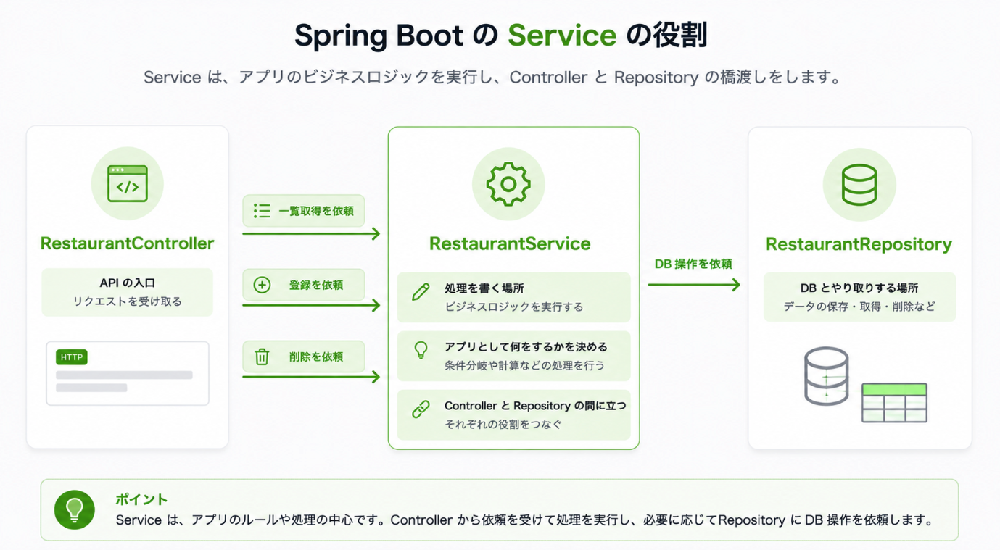
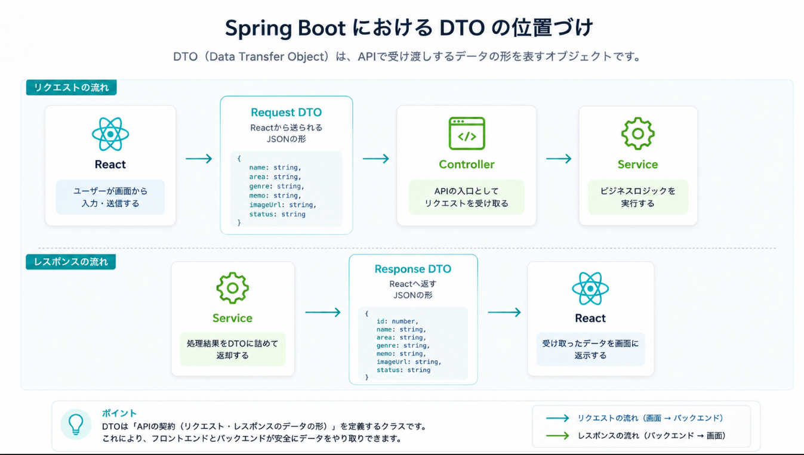

# Day 2: Spring Bootの基本

## 今日のゴール

- Spring Bootプロジェクトの構成を理解する
- Controllerの役割を理解する
- Serviceの役割を理解する
- Repositoryの役割を理解する
- お店一覧APIを作ってJSONで返せる
- 生成されたSpring Bootコードを層ごとに読める

## 扱う内容

- Spring Bootのプロジェクト構成
- Javaのclass
- Spring BootのDI
- Controller / Service / Repository
- DTO
- APIの動作確認
- 画像URLを含むレスポンス

## ライブコーディングと演習

```text
ライブコーディング  MovieController / MovieService
演習              RestaurantController / RestaurantService
```

Movieで作った一覧APIと同じ構造で、Restaurantの一覧APIを作ります。
Day2の演習では、説明していない詳細APIやDB保存は扱いません。

## 進める順番

```text
1. Day1の全体像を復習し、今日はバックエンドだけを見る
2. Spring Bootのディレクトリ構造とファイルの役割を確認する
3. JavaのclassとSpring BootのDIを確認する
4. Controller、Service、Repositoryの流れを図で確認する
5. DTOとJSONレスポンスの形を確認する
6. 固定データを返す一覧APIを段階的に実装する
7. ブラウザまたはAPIクライアントで動作確認する
8. 演習の進め方と確認ポイントを確認する
```

Day2では、DB保存までは急ぎません。
まずは「APIの入口にリクエストが届き、JSONが返る」ことを理解します。

## 今日の大事な考え方

Spring Bootでは、処理を役割ごとに分けて書く。

```text
Controller  APIの入口
Service     業務処理を書く場所
Repository  DBアクセスを書く場所
Entity      DBに保存するデータの形
DTO         APIで受け渡しするデータの形
```

AIがコードを生成した場合も、まず「このコードはどの役割か」を見る。

## 最初に伝えること

Spring Bootのコードは、1つのファイルに全部書かない。

APIの入口、処理、DBアクセスを分けて書く。
この分け方を理解すると、生成されたコードを読めるようになる。

最初に覚える本線はこれ。

```text
Controller -> Service -> Repository -> DB
```

DTO、Entity、Mapperは後で追加する概念。
最初から全部覚えようとせず、まずはこの一本道を理解する。



この図では、まずSpring Bootの本線だけを見ます。

```text
Browser / React -> Controller -> Service -> Repository -> Database
```

DTO、Entity、Mapperはまだ覚えなくて大丈夫です。
最初は「APIの入口」「処理を書く場所」「DBとやり取りする場所」の3つに分けて考えます。

## Spring Bootのディレクトリ構造

Spring Boot側は `backend/` に作ります。

まずは、どのファイルが何の役割なのかを見えるようにします。

```text
backend/
└─ src/
   └─ main/
      ├─ java/
      │  └─ com/example/gourmet/
      │     ├─ GourmetApplication.java
      │     ├─ controller/
      │     │  ├─ MovieController.java
      │     │  └─ RestaurantController.java
      │     ├─ service/
      │     │  ├─ MovieService.java
      │     │  └─ RestaurantService.java
      │     ├─ repository/
      │     │  ├─ MovieRepository.java
      │     │  └─ RestaurantRepository.java
      │     ├─ entity/
      │     │  ├─ Movie.java
      │     │  ├─ Restaurant.java
      │     │  └─ RestaurantStatus.java
      │     ├─ dto/
      │     │  ├─ movie/
      │     │  │  ├─ MovieRequest.java
      │     │  │  └─ MovieResponse.java
      │     │  └─ restaurant/
      │     │     ├─ RestaurantRequest.java
      │     │     └─ RestaurantResponse.java
      │     └─ mapper/
      │        ├─ MovieMapper.java
      │        └─ RestaurantMapper.java
      └─ resources/
         └─ application.yml
```

この教材では、Controller、Service、Repositoryなどの役割がすぐ見つかるように、層ごとにディレクトリを分けます。
`dto/` はMovie用とRestaurant用で分け、APIで受け渡しするデータの形を探しやすくします。

最初に見るファイル:

```text
controller/RestaurantController.java
service/RestaurantService.java
repository/RestaurantRepository.java
```

あとから見るファイル:

```text
entity/Restaurant.java
dto/restaurant/RestaurantRequest.java
dto/restaurant/RestaurantResponse.java
mapper/RestaurantMapper.java
entity/RestaurantStatus.java
```

ファイル名を見るだけでも、おおよその役割が分かるようにしておきます。

```text
controller/   APIの入口
service/      処理を書く場所
repository/   DBとやり取りする場所
dto/          ReactとAPIで受け渡しするデータ
mapper/       DTOとEntityを変換する
entity/       DBに保存するデータ
```

## ClassとDIの基本

Spring Bootのコードは、基本的に `class` を役割ごとに作って組み合わせます。

```text
MovieController  APIの入口を担当するclass
MovieService     処理を担当するclass
MovieResponse    APIで返すデータの形を表すrecord
```

`class` は、処理やデータのまとまりです。
Controllerに全部の処理を書くのではなく、Controller、Service、Repositoryのように役割ごとのclassに分けます。

### classの読み方

```java
public class MovieController {
}
```

```text
public
  他のclassから使える。

class
  Javaで処理やデータのまとまりを定義するキーワード。

MovieController
  classの名前。
  この名前を見ると、MovieのAPI入口を担当すると分かる。
```

### DIとは

DIは、Dependency Injectionの略です。
日本語では「依存性の注入」と呼ばれます。

言葉は難しいですが、まずは次のように考えます。

```text
ControllerはServiceを使いたい
  ↓
Controllerが自分でServiceをnewしない
  ↓
Spring Bootが必要なServiceを渡してくれる
```

つまり、DIは「必要な部品をSpring Bootに渡してもらう仕組み」です。



図では、`MovieController` が `MovieService` を使いたい場面を表しています。
Controllerが `new MovieService()` で自分で作るのではなく、Spring Boot Containerが管理しているServiceを渡してくれます。
この「必要な部品を渡してもらう」流れがDIです。

### DIを使わない書き方

```java
public class MovieController {

    private final MovieService movieService = new MovieService();
}
```

この書き方では、Controllerが自分でServiceを作っています。
小さいサンプルでは動きますが、実際のSpring Bootではこの書き方を避けます。

理由:

- ControllerがServiceの作り方まで知ってしまう
- テストしにくくなる
- Spring Bootが管理する機能を使いにくくなる

### DIを使う書き方

```java
@RestController
@RequestMapping("/api/movies")
public class MovieController {

    private final MovieService movieService;

    public MovieController(MovieService movieService) {
        this.movieService = movieService;
    }
}
```

1行ずつ読む:

```text
@RestController
  このclassはAPIのControllerだとSpring Bootに伝える。

@RequestMapping("/api/movies")
  このControllerのAPIは /api/movies から始まる。

private final MovieService movieService;
  このControllerはMovieServiceを使う。
  finalなので、一度受け取ったら差し替えない。

public MovieController(MovieService movieService)
  コンストラクタ。
  Spring BootがMovieServiceを渡してくれる入口。

this.movieService = movieService;
  渡されたMovieServiceを、このControllerの中で使えるように保存する。
```

### ServiceをSpring Bootに管理してもらう

DIで渡してもらう側のServiceには、Spring Bootが見つけられる目印を付けます。

```java
@Service
public class MovieService {
}
```

```text
@Service
  このclassはServiceとしてSpring Bootが管理する対象だと伝える。

public class MovieService
  Movieに関する処理を書くclass。
```

覚え方:

```text
@RestController  APIの入口として管理してもらう
@Service         処理を書く部品として管理してもらう
コンストラクタ     必要な部品を受け取る入口
```

Day2では、ControllerがServiceを使うためにDIを使うところまで理解できれば十分です。

## 役割を日常の言葉で考える

### Controller

受付。

外から来たリクエストを受け取る。
URLとHTTPメソッドを見て、どの処理を呼ぶか決める。



```text
GET /api/restaurants が来た
  -> RestaurantServiceに一覧取得をお願いする
```

### Service

担当者。

アプリとして何をするかを書く場所。
登録する、一覧を取得する、編集する、削除するなどの処理の中心。



### Repository

DB係。

DBに保存する、DBから取得する、DBから削除するなどを担当する。
ServiceはRepositoryを通してDBにアクセスする。


### DTO

APIで受け渡しするデータの形。

Reactから送られてくるJSON、Reactへ返すJSONをJavaの形で表す。

Day2では「APIの入出力の形」くらいの理解でよい。



DTOはReactとSpring Bootが安全にデータを受け渡すための形です。

```text
Request DTO   Reactから送られるJSONの形
Response DTO  Reactへ返すJSONの形
```

Day2では、DTOを「APIで使うデータの形」として理解できれば十分です。

## コードを読む順番

Spring Bootのコードは、ファイル一覧の上から順に読むよりも、リクエストが通る順番で読むと理解しやすくなります。

ここはかなり重要です。
AIが生成したコードを確認するときも、自分で機能を追加するときも、まずこの順番で読みます。

```text
1. Controllerを見る
   確認すること:
   - どのURLを受け取るか
   - GET / POST / PUT / DELETE のどれか
   - Serviceのどのメソッドを呼んでいるか

   例:
   GET /api/restaurants が list() に入ってくる

2. Serviceを見る
   確認すること:
   - 一覧取得、登録、編集、削除のどの処理か
   - 条件分岐やデータの加工があるか
   - Repositoryのどのメソッドを呼んでいるか

   例:
   findAll() で全件取得して、Response DTOに変換して返す

3. Repositoryを見る
   確認すること:
   - DBから取得しているのか
   - DBへ保存しているのか
   - 条件付き検索をしているのか

   例:
   findAll() で restaurants テーブルのデータを取得する

4. DTOを見る
   確認すること:
   - Reactから受け取るJSONの形
   - Reactへ返すJSONの形
   - 画面に必要な項目が入っているか

   例:
   RestaurantResponse に name, area, genre, memo, imageUrl, status がある
```

AIにコードを生成してもらった後も、この順番で読む。
動いたかどうかだけでなく、どの層に何が書かれているかを見る。

覚え方:

```text
Controller  どのAPIかを見る
Service     何をする処理かを見る
Repository  DBとどうやり取りするかを見る
DTO         JSONの形を見る
```

## 変更したい内容と見るファイル

```text
APIのURLを確認したい
  -> controller/RestaurantController.java

登録や一覧取得の処理を確認したい
  -> service/RestaurantService.java

DBへの保存・取得を確認したい
  -> repository/RestaurantRepository.java

APIで受け取るJSONの形を確認したい
  -> dto/restaurant/RestaurantRequest.java

APIで返すJSONの形を確認したい
  -> dto/restaurant/RestaurantResponse.java

DBに保存する項目を確認したい
  -> entity/Restaurant.java
```

## 図で確認すること

- Controller / Service / Repository の役割図
- リクエストがControllerに届いてレスポンスが返るまでの流れ
- お店データがJSONとして返る流れ

## API処理の流れ

```text
GET /api/restaurants
  ↓
RestaurantController
  ↓
RestaurantService
  ↓
RestaurantRepository
  ↓
DB
  ↓
JSONでレスポンス
```

## ライブコーディング: Movie一覧API

ここからは、講師がMovie題材で一覧APIを作ります。
参加者は、どのファイルに何を書くのか、なぜその順番で作るのかを見ながら確認します。

作るAPI:

```text
GET /api/movies
```

返すJSONの例:

```json
[
  {
    "id": 1,
    "title": "Inception",
    "genre": "SF",
    "memo": "夢の中に入っていく映画",
    "imageUrl": "https://example.com/inception.jpg",
    "status": "WATCHED"
  }
]
```

## 実装の進め方

一気に全部作らず、次の順番で作ります。
小さく作って、毎回動作確認してから次へ進みます。

```text
1. 文字列を返す
   APIに届いていることだけ確認する

2. DTOを作る
   JSONの形を決める

3. DTOのリストを返す
   Reactへ返すデータの形を確認する

4. Serviceへ移す
   ControllerとServiceの役割を分ける
```

一度に完成形を貼るよりも、途中で止める方が「今どこを作っているのか」が分かりやすくなります。

### 1. Controllerだけで固定文字列を返す

まずはAPIにアクセスできるか確認します。

```java
@GetMapping
public String hello() {
    return "movies api";
}
```

1行ずつ読む:

```text
@GetMapping
  GETリクエストを受け取るメソッドだとSpring Bootに伝える。

public String hello()
  APIが呼ばれたときに実行されるメソッド。
  Stringを返すので、文字列のレスポンスになる。

return "movies api";
  ブラウザやAPIクライアントへ返す文字列。
```

確認すること:

```text
GET /api/movies にアクセスできる
404ではない
Spring Bootが起動している
```

### 2. DTOを作ってJSONを返す

次に、Reactへ返したい形を `MovieResponse` として作ります。

```java
public record MovieResponse(
        Long id,
        String title,
        String genre,
        String memo,
        String imageUrl,
        String status
) {
}
```

1行ずつ読む:

```text
public record MovieResponse(...)
  Reactへ返すデータの形を定義している。
  recordは、値をまとめて持つためのJavaの書き方。

Long id
  映画を区別するID。

String title
  映画タイトル。

String genre
  ジャンル。

String memo
  メモ。

String imageUrl
  画像URL。画像ファイル本体ではなく、URL文字列を持つ。

String status
  見たい、見た、お気に入りなどの状態。
```

見るポイント:

- フィールド名がJSONのキーになる
- `imageUrl` も普通の文字列として扱う
- ReactはこのJSONを受け取って画面に表示する

### 3. ControllerからDTOのリストを返す

```java
@GetMapping
public List<MovieResponse> findAll() {
    return List.of(
            new MovieResponse(
                    1L,
                    "Inception",
                    "SF",
                    "夢の中に入っていく映画",
                    "https://example.com/inception.jpg",
                    "WATCHED"
            )
    );
}
```

1行ずつ読む:

```text
@GetMapping
  GET /api/movies が来たときに、このメソッドを動かす。

public List<MovieResponse> findAll()
  MovieResponseを複数件返すメソッド。
  Listなので、JSONでは配列として返る。

return List.of(...)
  固定の映画データをリストとして返す。

new MovieResponse(...)
  Reactへ返す1件分の映画データを作っている。

1L
  idの値。Long型なのでLを付けている。

"Inception"
  titleに入る値。

"SF"
  genreに入る値。

"夢の中に入っていく映画"
  memoに入る値。

"https://example.com/inception.jpg"
  imageUrlに入る値。

"WATCHED"
  statusに入る値。
```

確認すること:

```text
レスポンスがJSON配列になっている
title, genre, memo, imageUrl, status が含まれている
画像URLが文字列として返っている
```

### 4. Serviceへ処理を移す

Controllerに直接データを書くと、APIの入口と処理が混ざります。
そのため、一覧を作る処理をServiceへ移します。

```text
Controller  リクエストを受け取る
Service     返すデータを用意する
```

まずServiceを作ります。

```java
@Service
public class MovieService {

    public List<MovieResponse> findAll() {
        return List.of(
                new MovieResponse(
                        1L,
                        "Inception",
                        "SF",
                        "夢の中に入っていく映画",
                        "https://example.com/inception.jpg",
                        "WATCHED"
                )
        );
    }
}
```

次にControllerからServiceを呼びます。
ここでDIを使います。

```java
@RestController
@RequestMapping("/api/movies")
public class MovieController {

    private final MovieService movieService;

    public MovieController(MovieService movieService) {
        this.movieService = movieService;
    }

    @GetMapping
    public List<MovieResponse> findAll() {
        return movieService.findAll();
    }
}
```

1行ずつ読む:

```text
@Service
  MovieServiceをSpring Bootに管理してもらう。

private final MovieService movieService;
  MovieControllerがMovieServiceを使うことを表す。

public MovieController(MovieService movieService)
  Spring BootからMovieServiceを受け取るコンストラクタ。

this.movieService = movieService;
  受け取ったMovieServiceをController内で使えるようにする。

return movieService.findAll();
  一覧取得の処理をServiceへ任せる。
```

ここで一度APIを確認します。
Serviceへ処理を移しても、ReactやBrunoから見えるAPIの結果は変わらないことを確認します。

```text
GET http://localhost:8080/api/movies
```

確認すること:

```text
ステータスコードが200になる
JSON配列が返る
title, genre, memo, imageUrl, status が含まれている
Controllerに直接データを書いていたときと同じ形で返る
```

ここで分かること:

```text
APIの入口はControllerのまま
データを用意する処理だけServiceへ移った
外から見えるAPIの形は変わっていない
```

この分け方を早めに覚えておくと、後で登録、編集、削除を追加しやすくなります。

ライブコーディングで作るファイル:

```text
controller/MovieController.java
service/MovieService.java
dto/movie/MovieResponse.java
```

## ライブコーディング用コピペコード

ライブコーディングでは、最初から完璧に手入力しなくて大丈夫です。
まず貼って動かし、その後で1行ずつ読みます。
できれば、次の順番で1ファイルずつ貼ります。

```text
1. MovieResponse
2. MovieService
3. MovieController
4. BrunoまたはブラウザでGET /api/moviesを確認
```

### dto/movie/MovieResponse.java

```java
package com.example.gourmet.dto.movie;

public record MovieResponse(
        Long id,
        String title,
        String genre,
        String memo,
        String imageUrl,
        String status
) {
}
```

### service/MovieService.java

```java
package com.example.gourmet.service;

import com.example.gourmet.dto.movie.MovieResponse;
import org.springframework.stereotype.Service;

import java.util.List;

@Service
public class MovieService {

    public List<MovieResponse> findAll() {
        return List.of(
                new MovieResponse(
                        1L,
                        "Inception",
                        "SF",
                        "夢の中に入っていく映画",
                        "https://example.com/images/inception.jpg",
                        "WATCHED"
                ),
                new MovieResponse(
                        2L,
                        "Iron Man",
                        "アクション",
                        "スーツを作って戦うヒーロー映画",
                        "https://example.com/images/iron-man.jpg",
                        "FAVORITE"
                )
        );
    }
}
```

### controller/MovieController.java

```java
package com.example.gourmet.controller;

import com.example.gourmet.dto.movie.MovieResponse;
import com.example.gourmet.service.MovieService;
import org.springframework.web.bind.annotation.GetMapping;
import org.springframework.web.bind.annotation.RequestMapping;
import org.springframework.web.bind.annotation.RestController;

import java.util.List;

@RestController
@RequestMapping("/api/movies")
public class MovieController {

    private final MovieService movieService;

    public MovieController(MovieService movieService) {
        this.movieService = movieService;
    }

    @GetMapping
    public List<MovieResponse> findAll() {
        return movieService.findAll();
    }
}
```

貼った後に見るポイント:

```text
MovieController
  /api/movies を受け取る
  MovieServiceをDIで受け取る
  findAll()をServiceへ任せる

MovieService
  固定の映画データを作る
  List<MovieResponse>として返す

MovieResponse
  Reactへ返すJSONの形を決める
```

## 演習: Restaurant一覧API

Movieで作った一覧APIと同じ構造で、Restaurantの一覧APIを作ります。
新しい技術を増やす演習ではなく、Movieで見た構造をRestaurantへ置き換える演習です。

作るAPI:

```text
GET /api/restaurants
```

作るファイル:

```text
controller/RestaurantController.java
service/RestaurantService.java
dto/restaurant/RestaurantResponse.java
```

参考にするMovie側の名前:

```text
Controller      MovieController
Service         MovieService
Response DTO    MovieResponse
API             GET /api/movies
JSON keys       id, title, genre, memo, imageUrl, status
```

Restaurant側では、上のMovie例に対応するクラス名、URL、JSONキーを自分で決めます。

固定データを3件返します。

条件:

- 地域が異なるお店を入れる
- ジャンルが異なるお店を入れる
- `imageUrl` を全件に入れる
- `status` を `WANT_TO_GO`、`VISITED`、`FAVORITE` のいずれかにする

確認すること:

- APIを呼ぶと3件のJSONが返る
- 各データに必要な項目が入っている
- ControllerとServiceの役割を説明できる
- Movieのどの部分をRestaurantへ置き換えたか説明できる

## AIへの依頼例

Day2では、まず固定データを返す一覧APIを作ります。
AIには、答えを全部丸投げするのではなく、Movieで見た構造をRestaurantへ置き換えるための補助を依頼します。

最初から詳しく書きすぎると、考える場所がなくなります。
まずは自分で次のメモを埋めます。

```text
Movieの一覧APIを参考にして、Restaurantの一覧APIを作りたいです。
まず、下の穴埋めが正しいか確認してください。

作るAPI:
______ /api/__________

返す項目:
id, ______, ______, ______, ______, ______, ______

作るファイル:
controller/____________________.java
service/____________________.java
dto/restaurant/____________________.java

条件:
- Controllerに書くこと: ______
- Serviceに書くこと: ______
- DB接続は使うか: ______
- レスポンスは配列か1件か: ______

MovieController、MovieService、MovieResponseのどこをRestaurantへ置き換えればよいか、
差分が分かるように説明してください。
```

参考にするMovie側の例:

```text
API path        /api/movies
HTTP method     GET
Controller      MovieController
Service         MovieService
Response DTO    MovieResponse
JSON keys       id, title, genre, memo, imageUrl, status
```

Restaurant側の名前、URL、JSONキーは、Movieの例を見ながら自分で埋めます。

AIの回答を確認するときのポイント:

- Controllerに処理を書きすぎていないか
- Serviceが一覧データを返しているか
- `RestaurantResponse` に必要な項目が揃っているか
- `imageUrl` が文字列として含まれているか
- `GET /api/restaurants` で呼べる形になっているか

## コードサンプル

最初はDBを使わず、固定データを返して流れを理解する。
ここは講師のライブコーディング用なので、Movie題材で見ます。
Restaurantの答えを先に出しすぎないようにします。

```java
@RestController
@RequestMapping("/api/movies")
public class MovieController {

    @GetMapping
    public List<MovieResponse> findAll() {
        return List.of(
                new MovieResponse(
                        1L,
                        "Inception",
                        "SF",
                        "夢の中に入っていく映画",
                        "https://example.com/inception.jpg",
                        "WATCHED"
                )
        );
    }
}
```

この時点では、Controllerだけでも動かせる。
ただし実務では処理が増えるので、ServiceやRepositoryに分けていく。

## 動作確認の観点

ブラウザやAPIクライアントで次のURLにアクセスする。

```text
http://localhost:8080/api/movies
```

確認すること:

- JSONが返ってくる
- `title`、`genre`、`memo`、`imageUrl`、`status` が含まれている
- 画像URLはただの文字列として返っている
- Reactで表示する前に、API単体で確認できる

## 今日の確認ポイント

- Controllerの役割を説明できる
- Serviceの役割を説明できる
- Repositoryの役割を説明できる
- APIがJSONを返すことを確認できる
- 固定データでも、Reactとつなぐ前のAPI確認として意味があると理解できる

## よくある混乱

### Controllerに全部書いてはいけないのですか

小さいサンプルなら動く。

ただし処理が増えると読みにくくなる。
そのため、Controllerは受付に集中し、処理はServiceに分ける。

### Serviceは必ず必要ですか

実務では入れることが多い。

理由は、APIの入口と処理の中身を分けた方が変更しやすいから。

### RepositoryはSQLを書く場所ですか

必ずしも手でSQLを書く場所ではない。

Spring Data JPAを使うと、基本的なCRUDはRepositoryのメソッドで扱える。

## メモ

Springの用語が多くなるので、最初は役割を日常的な言葉に置き換えて説明する。
