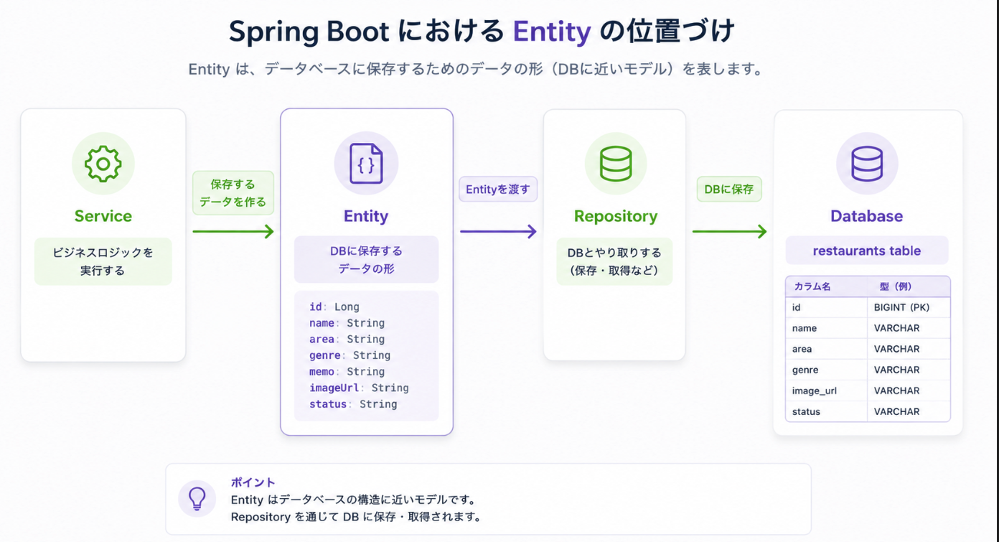
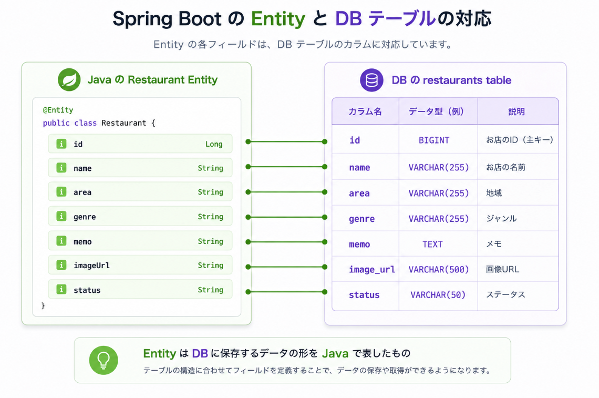
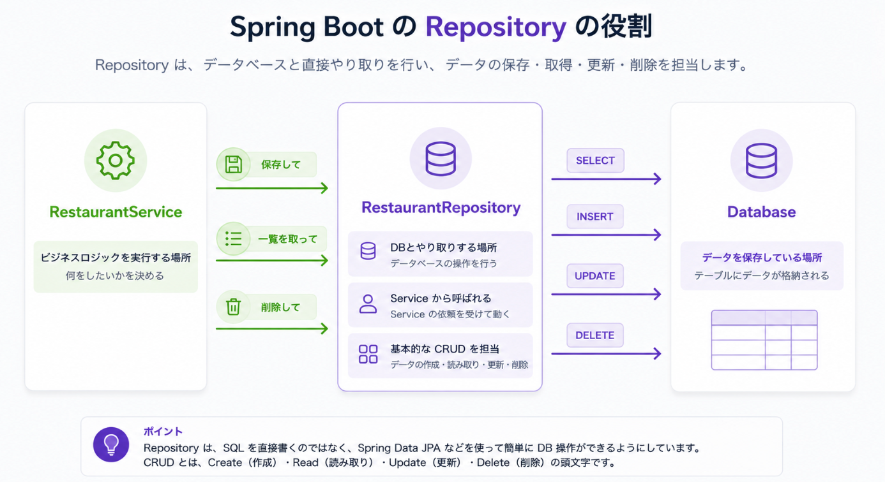
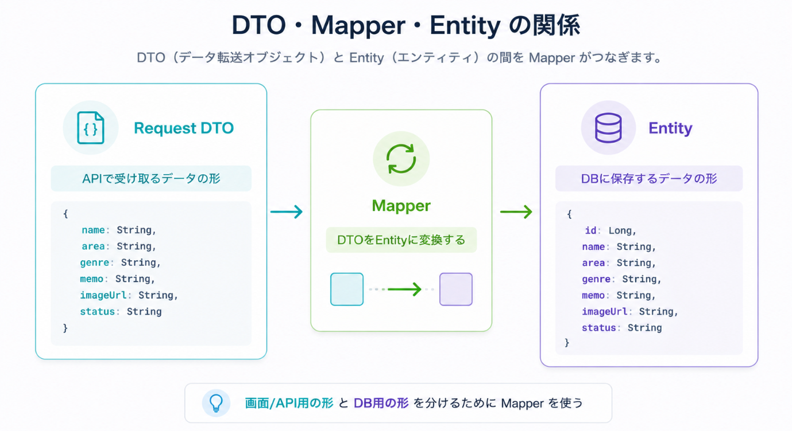
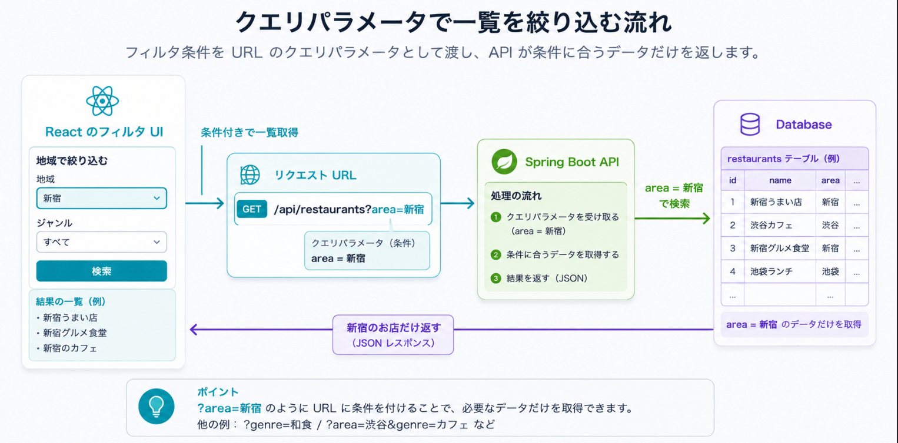

# Day 3: DB接続とCRUD API

## 今日のゴール

- Entityの役割を理解する
- Repositoryを使ってDBにアクセスできる
- CRUD APIを作れる
- APIの正常系と簡単な異常系を確認できる
- 地域・ジャンル・ステータスで絞り込む考え方を理解する
- 仕様変更時にどの層を直すか判断できる

## 扱う内容

- Entity
- Repository
- CRUD
- バリデーション
- エラーレスポンス
- クエリパラメータ

## ライブコーディングと演習

```text
ライブコーディング  MovieのCRUD API
演習              RestaurantのCRUD API
```

Movieで説明したCRUDと同じ構造で、RestaurantのCRUDを作ります。
Movieで説明していない検索条件や複雑なバリデーションは演習に出しません。

## 進める順番

```text
1. Day2の固定データAPIを復習する
2. EntityとDBテーブルの関係を図で確認する
3. Repositoryで使う基本操作を確認する
4. DTO、Entity、Mapperの役割を確認する
5. 登録、一覧、詳細APIを段階的に実装する
6. 更新、削除、フィルタの考え方を確認する
7. 演習の進め方と確認ポイントを確認する
```

Day3では、APIがDBとつながります。
作る量が多いので、まず登録と一覧を確実に動かし、その後に詳細、更新、削除、フィルタへ広げます。

## 今日の大事な考え方

CRUDは多くの業務アプリの基本になる。

```text
Create  登録する
Read    一覧・詳細を見る
Update  編集する
Delete  削除する
```

この4つを一度作ると、申請管理、台帳管理、レビュー管理など多くのアプリに応用できる。

## 最初に伝えること

Day2では固定データを返した。
Day3では、データをDBに保存する。

DBを使うと、アプリを再起動してもデータを残せる。
登録、編集、削除の結果が保存されるため、アプリらしくなる。

```text
固定データ:
コードに書いてあるだけのデータ

DB保存:
アプリの外に保存され、後から取得できるデータ
```

## Entityとは

Entityは、DBに保存するデータの形をJavaで表したもの。



グルメ管理アプリでは、`Restaurant` Entityを作る。

```text
Restaurant Entity
  id
  name
  area
  genre
  memo
  imageUrl
  status
```

DBのテーブルに近い考え方。



```text
JavaのEntity  <->  DBのテーブル
Restaurant    <->  restaurants
```

## Repositoryとは

Repositoryは、EntityをDBに保存したり、DBから取得したりするための入口。



Spring Data JPAを使うと、次のような操作を自分で細かくSQLを書かなくても使える。

```text
save       登録・更新
findAll    一覧取得
findById   詳細取得
delete     削除
```

まずは、Repositoryは「DB操作をまとめたもの」と理解すればよい。

## Mapperとは

Mapperは、DTOとEntityを変換する役割です。



ReactとAPIの間ではDTOを使い、DBに保存するときはEntityを使います。
この2つは目的が違うため、変換する場所が必要になります。

```text
Request DTO -> Mapper -> Entity
Entity -> Mapper -> Response DTO
```

最初は「MapperはDTOとEntityの変換係」と理解すれば十分です。

## CRUDとHTTPメソッド

画面の操作、HTTPメソッド、APIは対応している。

```text
お店を登録する
  -> POST /api/restaurants

お店一覧を見る
  -> GET /api/restaurants

お店詳細を見る
  -> GET /api/restaurants/{id}

お店を編集する
  -> PUT /api/restaurants/{id}

お店を削除する
  -> DELETE /api/restaurants/{id}
```

この対応が分かると、React側でどのAPIを呼べばよいか判断しやすくなる。

## 図で確認すること

- CRUDとHTTPメソッドの対応図
- DBテーブルとEntityの対応図
- RepositoryがServiceとDBの間に立つ図
- クエリパラメータで一覧を絞り込む流れ

## CRUDとAPIの対応

```text
POST   /api/restaurants       登録
GET    /api/restaurants       一覧
GET    /api/restaurants/{id}  詳細
PUT    /api/restaurants/{id}  編集
DELETE /api/restaurants/{id}  削除
```

## ライブコーディング: MovieのDB保存API

説明者がMovie題材で、DB保存を使ったAPIを作ります。
Day3では量が多いため、最初に登録と一覧を確実に理解します。

まず作るAPI:

```text
POST /api/movies
GET  /api/movies
```

その後、詳細、更新、削除の考え方を確認します。

```text
GET    /api/movies/{id}
PUT    /api/movies/{id}
DELETE /api/movies/{id}
```

余裕があれば、一覧APIにフィルタを追加する。



```text
GET /api/movies?genre=SF
GET /api/movies?status=WATCHED
```

## ライブコーディングで作る場所

Day3のライブコーディングは、Spring Bootプロジェクトの `backend/` 側で行います。
IntelliJ IDEAで `backend` を開き、次の場所を起点にします。

```text
backend/src/main/java/com/example/gourmet/
```

Day3ではDBを使うため、Javaファイルを作る前に `backend/pom.xml` と `application.yml` も確認します。

```text
backend/pom.xml
  Spring Data JPA と DBドライバの依存関係を確認する

backend/src/main/resources/application.yml
  DB接続先を確認する
```

Day2の段階ではDBを使わないため、Spring Boot Webだけで動かせます。
Day3でRepositoryを使うタイミングで、DB接続に必要な設定を追加します。

`pom.xml` で確認する依存関係:

```xml
<dependency>
    <groupId>org.springframework.boot</groupId>
    <artifactId>spring-boot-starter-data-jpa</artifactId>
</dependency>

<dependency>
    <groupId>org.postgresql</groupId>
    <artifactId>postgresql</artifactId>
    <scope>runtime</scope>
</dependency>
```

```text
spring-boot-starter-data-jpa
  RepositoryやEntityを使ってDB操作をするために必要。

postgresql
  Spring BootからPostgreSQLへ接続するために必要。
```

Day3では、Day2で作ったMovie APIをDB保存版へ育てます。
そのため、新しく作るファイルと、Day2から編集するファイルがあります。

新しく作るファイル:

```text
com/example/gourmet/
├─ entity/
│  └─ Movie.java
├─ repository/
│  └─ MovieRepository.java
├─ dto/
│  └─ movie/
│     └─ MovieRequest.java
└─ mapper/
   └─ MovieMapper.java
```

Day2から編集するファイル:

```text
com/example/gourmet/
├─ controller/
│  └─ MovieController.java
├─ service/
│  └─ MovieService.java
└─ dto/
   └─ movie/
      └─ MovieResponse.java
```

説明者は、作る前に次のように説明すると迷いにくくなります。

```text
Day2では、Serviceの中に固定データを書きました。
Day3では、固定データをやめてDBに保存します。

そのため、DBに保存する形としてEntityを作ります。
DB操作の入口としてRepositoryを作ります。
Reactから受け取る形としてRequest DTOを作ります。
DTOとEntityを変換するMapperを作ります。

ControllerとServiceは、Day2で作ったものをDB保存版に変更します。
```

### IntelliJ IDEAで作る手順

まず、新しく必要になるパッケージを作ります。

```text
1. com.example.gourmet を右クリック
2. New -> Package
3. entity と入力する
4. 同じように repository と mapper を作る
```

`dto.movie` はDay2で作っている場合はそのまま使います。
まだない場合は、次のように作ります。

```text
1. com.example.gourmet を右クリック
2. New -> Package
3. dto.movie と入力する
```

次に、ファイルを作ります。

```text
entity パッケージ
  -> Movie.java

repository パッケージ
  -> MovieRepository.java

dto.movie パッケージ
  -> MovieRequest.java
  -> MovieResponse.java

mapper パッケージ
  -> MovieMapper.java

service パッケージ
  -> MovieService.java を編集する

controller パッケージ
  -> MovieController.java を編集する
```

作った直後に確認すること:

```text
GourmetApplication.java と同じ com.example.gourmet 配下にある
package行とディレクトリの位置が合っている
Movie題材のファイルだけを作っている
Restaurantの答えを先に作っていない
```

package行の例:

```java
package com.example.gourmet.repository;
```

これは、次の場所にあるファイルだという意味です。

```text
backend/src/main/java/com/example/gourmet/repository/MovieRepository.java
```

## 実装の進め方

CRUDは量が多いため、次の順番で進めます。

### 1. Entityを作る

まずDBに保存する形を作ります。
作るファイルは `entity/Movie.java` です。

```java
@Entity
public class Movie {

    @Id
    @GeneratedValue(strategy = GenerationType.IDENTITY)
    private Long id;

    private String title;
    private String genre;
    private String memo;
    private String imageUrl;
    private String status;
}
```

見るポイント:

- `@Entity` がDBに保存するクラスであることを表す
- `id` はDB上で1件を区別するために使う
- Reactへ返すJSONではなく、DBに保存する形である

1行ずつ読む:

```text
@Entity
  このクラスをDBに保存する対象として扱う。

public class Movie
  映画データを表すJavaクラス。

@Id
  このフィールドが主キーであることを表す。
  主キーは、DB上で1件のデータを区別するために使う。

@GeneratedValue(strategy = GenerationType.IDENTITY)
  idの値をDBに自動で作ってもらう。

private Long id;
  映画のID。

private String title;
  映画タイトル。

private String genre;
  ジャンル。

private String memo;
  メモ。

private String imageUrl;
  画像URL。

private String status;
  ステータス。
```

### 2. Repositoryを作る

作るファイルは `repository/MovieRepository.java` です。

```java
public interface MovieRepository extends JpaRepository<Movie, Long> {
}
```

1行ずつ読む:

```text
public interface MovieRepository
  Movie用のRepositoryを定義している。
  RepositoryはDB操作の入口。

extends JpaRepository<Movie, Long>
  Spring Data JPAが用意している基本的なDB操作を使えるようにする。

Movie
  このRepositoryで扱うEntity。

Long
  MovieのIDの型。

{ }
  中身が空でも、save、findAll、findById、deleteなどを使える。
```

これだけで、基本的なDB操作を使えるようになります。

```text
save       登録・更新
findAll    一覧取得
findById   詳細取得
delete     削除
```

### 3. Request DTO、Response DTO、Mapperを作る

DBに保存する前に、APIで受け渡しする形を分けます。

作るファイル:

```text
dto/movie/MovieRequest.java
dto/movie/MovieResponse.java
mapper/MovieMapper.java
```

```java
public record MovieRequest(
        String title,
        String genre,
        String memo,
        String imageUrl,
        String status
) {
}
```

1行ずつ読む:

```text
public record MovieRequest(...)
  Reactから送られてくるJSONの形を表す。

String title
  登録フォームから送られる映画タイトル。

String genre
  ジャンル。

String memo
  メモ。

String imageUrl
  画像URL。

String status
  見たい、見た、お気に入りなどの状態。
```

```java
public record MovieResponse(
        Long id,
        String title,
        String genre,
        String memo,
        String imageUrl,
        String status
) {
}
```

1行ずつ読む:

```text
public record MovieResponse(...)
  Reactへ返すJSONの形を表す。

Long id
  DBに保存されたあとに付くID。

title, genre, memo, imageUrl, status
  画面に表示するために返す値。
```

```java
@Component
public class MovieMapper {

    public Movie toEntity(MovieRequest request) {
        Movie movie = new Movie();
        movie.setTitle(request.title());
        movie.setGenre(request.genre());
        movie.setMemo(request.memo());
        movie.setImageUrl(request.imageUrl());
        movie.setStatus(request.status());
        return movie;
    }

    public MovieResponse toResponse(Movie movie) {
        return new MovieResponse(
                movie.getId(),
                movie.getTitle(),
                movie.getGenre(),
                movie.getMemo(),
                movie.getImageUrl(),
                movie.getStatus()
        );
    }
}
```

1行ずつ読む:

```text
@Component
  MovieMapperをSpring Bootに管理してもらう。
  ServiceへDIできるようにする。

toEntity(MovieRequest request)
  Reactから受け取ったRequest DTOを、DB保存用のEntityに変換する。

new Movie()
  DBに保存するためのMovie Entityを作る。

movie.setTitle(request.title())
  Request DTOのtitleをEntityへ詰め替える。

return movie;
  Repositoryで保存できる形にして返す。

toResponse(Movie movie)
  DBから取得したEntityを、Reactへ返すResponse DTOに変換する。

movie.getId()
  DBで作られたIDをResponse DTOへ入れる。
```

### 4. 登録APIを作る

登録では、Request DTOをEntityに変換してDBに保存します。

```text
MovieRequest
  ↓ Mapper
Movie Entity
  ↓ Repository.save
DBに保存
```

最初に確認すること:

- POSTでJSONを送れる
- DBに保存される
- レスポンスに `id` が入る

Serviceでは、Request DTO、Mapper、Repositoryをつなぎます。
編集するファイルは `service/MovieService.java` です。

```java
@Service
public class MovieService {

    private final MovieRepository movieRepository;
    private final MovieMapper movieMapper;

    public MovieService(MovieRepository movieRepository, MovieMapper movieMapper) {
        this.movieRepository = movieRepository;
        this.movieMapper = movieMapper;
    }

    public MovieResponse create(MovieRequest request) {
        Movie movie = movieMapper.toEntity(request);
        Movie savedMovie = movieRepository.save(movie);
        return movieMapper.toResponse(savedMovie);
    }
}
```

1行ずつ読む:

```text
private final MovieRepository movieRepository;
  DB操作を行うRepositoryを使う。

private final MovieMapper movieMapper;
  DTOとEntityを変換するMapperを使う。

public MovieService(...)
  Spring BootがRepositoryとMapperを渡してくれる。

Movie movie = movieMapper.toEntity(request);
  Reactから受け取ったRequest DTOをEntityへ変換する。

Movie savedMovie = movieRepository.save(movie);
  EntityをDBへ保存する。
  保存後はidが入ったEntityが返る。

return movieMapper.toResponse(savedMovie);
  保存した結果をResponse DTOに変換してReactへ返す。
```

Controllerでは、URLとHTTPメソッドを受け取り、Serviceへ処理を依頼します。
編集するファイルは `controller/MovieController.java` です。

```java
@RestController
@RequestMapping("/api/movies")
public class MovieController {

    private final MovieService movieService;

    public MovieController(MovieService movieService) {
        this.movieService = movieService;
    }

    @PostMapping
    public MovieResponse create(@RequestBody MovieRequest request) {
        return movieService.create(request);
    }
}
```

1行ずつ読む:

```text
@RestController
  このクラスがREST APIのControllerであることを表す。
  戻り値はJSONとして返される。

@RequestMapping("/api/movies")
  このControllerのAPI URLの共通部分を指定する。
  この中のAPIは /api/movies から始まる。

private final MovieService movieService;
  実際の登録処理をServiceへ任せるために、MovieServiceを持つ。

public MovieController(MovieService movieService)
  Spring BootがMovieServiceを渡してくれる。
  これがDIの基本形。

@PostMapping
  POST /api/movies が来たときに、このメソッドを動かす。

public MovieResponse create(...)
  登録結果としてMovieResponseを返す。
  JSONでは1件分の映画データとして返る。

@RequestBody MovieRequest request
  リクエストボディのJSONをMovieRequestとして受け取る。
  Reactから送られたtitle、genre、memoなどが入る。

return movieService.create(request);
  Controller自身では保存処理を書かない。
  Serviceに依頼し、返ってきたResponse DTOをそのまま返す。
```

### 5. 一覧APIをDBから返す

固定データではなく、DBから取得したデータを返します。

```text
Repository.findAll()
  ↓
Entityのリスト
  ↓ Mapper
Response DTOのリスト
  ↓
JSONレスポンス
```

Serviceに一覧取得の処理を追加します。

```java
public List<MovieResponse> findAll() {
    return movieRepository.findAll()
            .stream()
            .map(movieMapper::toResponse)
            .toList();
}
```

1行ずつ読む:

```text
public List<MovieResponse> findAll()
  MovieResponseを複数件返すメソッド。
  JSONでは配列として返る。

movieRepository.findAll()
  DBに保存されているMovie Entityをすべて取得する。

.stream()
  取得したリストを、1件ずつ変換できる流れにする。

.map(movieMapper::toResponse)
  Movie EntityをMovieResponseへ1件ずつ変換する。
  EntityをそのままReactへ返さないためにMapperを使う。

.toList()
  変換したMovieResponseをListに戻す。
```

Controllerでは、GETリクエストを受け取ってServiceへ渡します。

```java
@GetMapping
public List<MovieResponse> findAll() {
    return movieService.findAll();
}
```

1行ずつ読む:

```text
@GetMapping
  GET /api/movies が来たときに、このメソッドを動かす。

public List<MovieResponse> findAll()
  MovieResponseを複数件返すメソッド。
  JSONでは配列として返る。

return movieService.findAll();
  ControllerではDB取得処理を書かない。
  一覧取得の処理はServiceへ任せる。
```

### 6. 詳細、更新、削除を追加する

登録と一覧が動いてから、IDを使うAPIを追加します。

```text
GET    /api/restaurants/{id}
PUT    /api/restaurants/{id}
DELETE /api/restaurants/{id}
```

IDを使うAPIでは、まず「そのIDのデータが存在するか」を確認します。

Serviceでは、`findById` で対象データを探してから処理します。

```java
public MovieResponse findById(Long id) {
    Movie movie = movieRepository.findById(id)
            .orElseThrow(() -> new RuntimeException("Movie not found"));

    return movieMapper.toResponse(movie);
}

public MovieResponse update(Long id, MovieRequest request) {
    Movie movie = movieRepository.findById(id)
            .orElseThrow(() -> new RuntimeException("Movie not found"));

    movie.setTitle(request.title());
    movie.setGenre(request.genre());
    movie.setMemo(request.memo());
    movie.setImageUrl(request.imageUrl());
    movie.setStatus(request.status());

    Movie savedMovie = movieRepository.save(movie);
    return movieMapper.toResponse(savedMovie);
}

public void delete(Long id) {
    Movie movie = movieRepository.findById(id)
            .orElseThrow(() -> new RuntimeException("Movie not found"));

    movieRepository.delete(movie);
}
```

1行ずつ読む:

```text
movieRepository.findById(id)
  URLで指定されたidのデータをDBから探す。

.orElseThrow(...)
  データが見つからない場合はエラーにする。
  存在しないidを更新・削除しないために必要。

movie.setTitle(request.title())
  リクエストで受け取った値を、既存のEntityへ上書きする。

movieRepository.save(movie)
  上書きしたEntityをDBへ保存する。
  新規登録でも更新でもsaveを使う。

movieRepository.delete(movie)
  見つかったEntityをDBから削除する。

public void delete(Long id)
  削除では返すデータが不要な場合があるため、戻り値をvoidにできる。
```

Controllerでは、URLの `{id}` を `@PathVariable` で受け取ります。

```java
@GetMapping("/{id}")
public MovieResponse findById(@PathVariable Long id) {
    return movieService.findById(id);
}

@PutMapping("/{id}")
public MovieResponse update(@PathVariable Long id, @RequestBody MovieRequest request) {
    return movieService.update(id, request);
}

@DeleteMapping("/{id}")
public void delete(@PathVariable Long id) {
    movieService.delete(id);
}
```

見るポイント:

- `{id}` はURLの一部
- `@PathVariable Long id` でURLのidを受け取る
- 更新ではURLのidとリクエストJSONの両方を使う
- 削除ではidだけで対象を探せる

### 7. クエリパラメータで絞り込む

一覧が動いた後に、条件付きの一覧取得を追加します。

```text
GET /api/restaurants?area=新宿
```

最初から複雑な検索にしすぎず、まずは地域だけで絞り込みます。
その後、ジャンルやステータスを追加します。

クエリパラメータは、URLの後ろにつける検索条件です。

```text
/api/restaurants?area=新宿
```

この場合、`area` が条件名で、`新宿` が条件の値です。
Spring Bootでは `@RequestParam` で受け取ります。

```java
@GetMapping
public List<MovieResponse> findAll(@RequestParam(required = false) String genre) {
    return movieService.findAll(genre);
}
```

1行ずつ読む:

```text
@RequestParam(required = false) String genre
  URLの ?genre=SF の値を受け取る。
  required = false なので、条件なしの一覧取得もできる。

movieService.findAll(genre)
  絞り込み条件をServiceへ渡す。
  Controllerでは検索処理そのものを書かない。
```

## 演習

次の順番でAPIを完成させます。

```text
1. 登録APIを作る
2. 一覧APIをDBから返す
3. 詳細APIを作る
4. 更新APIを作る
5. 削除APIを作る
6. 地域フィルタを追加する
```

各APIごとに確認すること:

- URLとHTTPメソッドが正しい
- リクエストJSONが想定通り
- レスポンスJSONが想定通り
- DBのデータが変わっている
- 存在しないIDを指定したときの動きが分かる

## AIへの依頼例

Day3では、DB保存とCRUD APIを作ります。
一度に全部依頼せず、登録と一覧から始めます。

最初に、自分で穴埋めしてからAIへ渡します。
ここでも、作るものを全部説明しすぎず、Movieで見た構造から置き換える前提にします。

```text
MovieのDB保存APIを参考にして、RestaurantのDB保存APIを作りたいです。
まず、下の穴埋めが正しいか確認してください。

まず作るもの:
- ______
- ______
- ______
- ______
- ______
- ______ /api/__________
- ______ /api/__________

項目:
id, ______, ______, ______, ______, ______, ______

条件:
- Movie EntityのどこをRestaurant Entityへ置き換えるか: ______
- MovieRequestのどこをRestaurantRequestへ置き換えるか: ______
- MovieResponseのどこをRestaurantResponseへ置き換えるか: ______
- MovieMapperのどこをRestaurantMapperへ置き換えるか: ______
- MovieServiceのどこをRestaurantServiceへ置き換えるか: ______
- MovieControllerのどこをRestaurantControllerへ置き換えるか: ______

コードを出す前に、Request DTO、Entity、Response DTO、Mapperの役割を短く説明してください。
```

参考にするMovie側の例:

```text
Entity          Movie
Repository      MovieRepository
Request DTO     MovieRequest
Response DTO    MovieResponse
Mapper          MovieMapper
Create API      POST /api/movies
List API        GET /api/movies
JSON keys       id, title, genre, memo, imageUrl, status
```

Restaurant側のクラス名、API、JSONキーは、Movieの例を見ながら自分で埋めます。

次の依頼例:

```text
Movieの詳細、更新、削除APIを参考にして、
Restaurant APIに同じ構造の ______、______、______ を追加したいです。

追加するAPI:
______ /api/restaurants/{id}
______ /api/restaurants/{id}
______ /api/restaurants/{id}

条件:
- 存在しないIDの場合はどう扱うか: ______
- 更新ではどのidを使って対象データを探すか: ______
- 削除後のレスポンスボディは必要か: ______

コードを出す前に、ServiceでfindById、save、deleteByIdのどれを使うか説明してください。
```

AIの回答を確認するときのポイント:

- EntityとDTOが混ざっていないか
- ControllerにDB操作が直接書かれていないか
- RepositoryをServiceから呼んでいるか
- 存在しないIDの扱いがあるか
- CRUDのHTTPメソッドが資料と合っているか

## リクエストとレスポンスの例

登録APIでは、ReactからSpring BootへJSONを送る。

```http
POST /api/restaurants
Content-Type: application/json
```

```json
{
  "name": "Cafe Sakura",
  "area": "新宿",
  "genre": "カフェ",
  "memo": "落ち着いて作業できそう",
  "imageUrl": "https://example.com/cafe.jpg",
  "status": "WANT_TO_GO"
}
```

Spring BootはDBに保存し、保存結果をJSONで返す。

```json
{
  "id": 1,
  "name": "Cafe Sakura",
  "area": "新宿",
  "genre": "カフェ",
  "memo": "落ち着いて作業できそう",
  "imageUrl": "https://example.com/cafe.jpg",
  "status": "WANT_TO_GO"
}
```

ポイントは、登録前のリクエストには `id` がなく、保存後のレスポンスには `id` があること。
`id` はDBに保存されたデータを区別するために使う。

## バリデーションの考え方

入力値が空のまま登録されると、使いにくいアプリになる。

最低限、次の項目は必須にする。

- 店名
- 地域
- ジャンル
- ステータス

メモと画像URLは任意でもよい。

最初から厳密に作り込みすぎない。
まずは「必須項目が空ならエラーにする」程度で十分。

## エラーレスポンスの考え方

APIは成功するときだけでなく、失敗するときもある。

例:

```text
存在しないIDを指定した
必須項目が空だった
URLが間違っていた
```

最初は次の違いを理解する。

```text
200 OK       成功
201 Created  登録成功
400 Bad Request  入力が間違っている
404 Not Found    データが見つからない
500 Internal Server Error  サーバー側の想定外エラー
```

## 今日の確認ポイント

- EntityはDBに保存するデータの形だと説明できる
- RepositoryはDB操作を担当すると説明できる
- CRUDとHTTPメソッドの対応を説明できる
- 登録前のJSONと保存後のJSONの違いを説明できる
- API単体で登録、一覧、詳細、編集、削除を確認できる

## よくある混乱

### EntityとDTOは同じですか

同じではない。

EntityはDBに保存する形。
DTOはAPIで受け渡しする形。

最初は似ていても、目的が違う。

### PUTとPOSTの違いは何ですか

POSTは新しく作る。
PUTは既にあるものを更新する。

```text
POST /api/restaurants
  -> 新しいお店を作る

PUT /api/restaurants/1
  -> id=1のお店を更新する
```

### フィルタは別APIにするべきですか

今回は一覧APIにクエリパラメータを付ける。

```text
GET /api/restaurants?area=新宿
```

一覧の条件違いなので、同じURLに条件を足す考え方でよい。

## メモ

DBは最初はH2を使うと環境差分が少ない。
