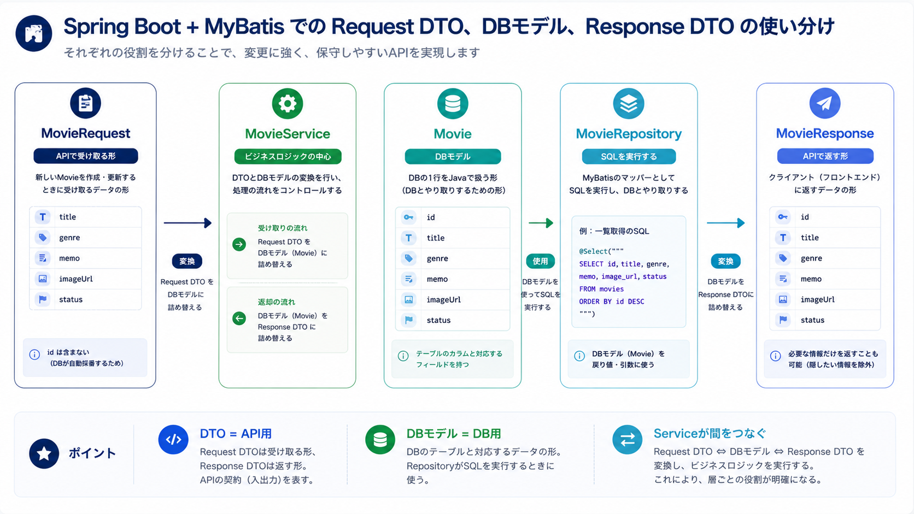
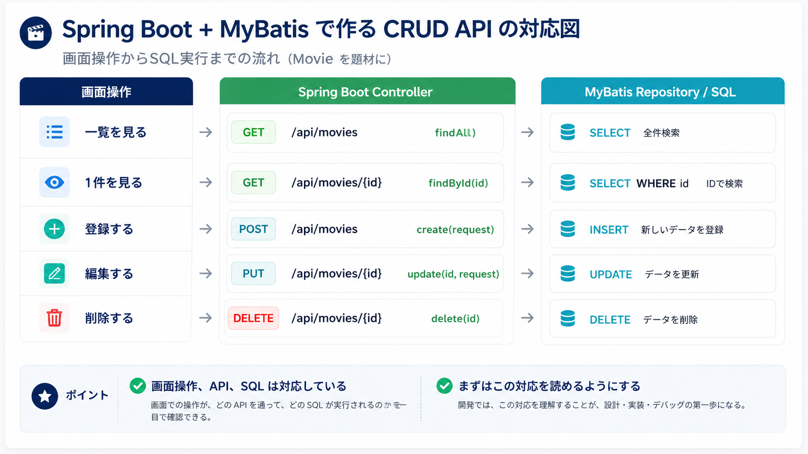
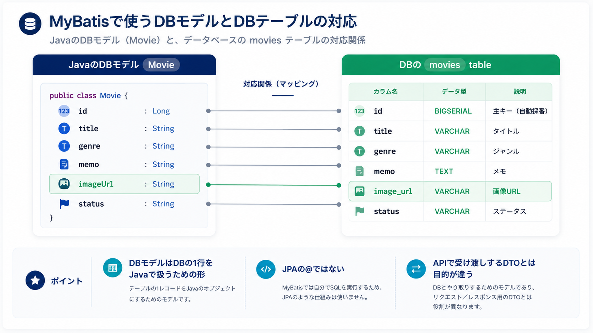
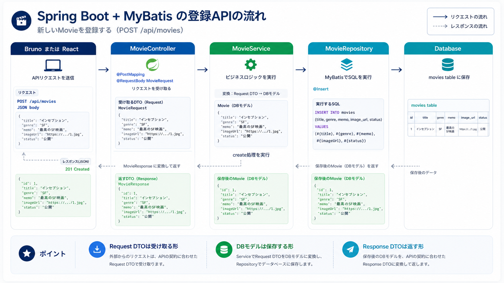

# Day 3: DB接続とCRUD API

## 今日のゴール

- DBに保存する流れを理解する
- MyBatisでSQLを書くRepositoryを作れる
- CRUD APIを作れる
- Request DTO、Response DTO、DBモデルの違いを説明できる
- Brunoで登録、一覧、詳細、更新、削除を確認できる

## 扱う内容

- MyBatis
- `@Mapper`
- `@Select` / `@Insert` / `@Update` / `@Delete`
- Request DTO / Response DTO
- DBモデル
- CRUD
- クエリパラメータ

## ライブコーディングと演習

```text
ライブコーディング  MovieのCRUD API
演習              RestaurantのCRUD API
```

Movieで説明したCRUDと同じ構造で、RestaurantのCRUDを作ります。
説明していない検索条件や複雑なバリデーションは演習に出しません。

## 進める順番

```text
1. Day2の固定データAPIを復習する
2. DBに保存するデータの形を確認する
3. MyBatisのRepositoryでSQLを書く流れを確認する
4. Request DTO、Response DTO、DBモデルの違いを確認する
5. 登録、一覧、詳細APIを段階的に実装する
6. 更新、削除、フィルタの考え方を確認する
7. Brunoで動作確認する
8. 演習の進め方と確認ポイントを確認する
```

Day3では、固定データをやめてDBに保存します。
SQLを実際に書くことで、どのテーブルからどのデータを取得しているのかを見えるようにします。

## Day3で使う図

Day3は新しい言葉が増えます。
先に図で全体像を見てから、コードを読むようにします。

```text
1. 画面操作とAPIの対応図
   CRUD APIが、どの画面操作に対応するかを見る。

2. Repositoryの役割図
   Service、Repository、Databaseの関係を見る。

3. DTOの位置づけ図
   Request DTO、Response DTOがどこで使われるかを見る。

4. クエリパラメータの図
   絞り込み条件がURLに入る流れを見る。
```

Day3では、次の画像を使います。

```text
images/crud-api-map.png
  画面操作、API、SQLの対応を見る図。

images/dbmodel-table-map.png
  DBモデルとDBテーブルの対応を見る図。

images/dto-dbmodel-flow.png
  Request DTO、DBモデル、Response DTOの違いを見る図。

images/create-api-mybatis-flow.png
  POST APIでDBに保存されるまでの流れを見る図。
```

## 今日の大事な考え方

CRUDは多くの業務アプリの基本です。

```text
Create  登録する
Read    一覧・詳細を見る
Update  編集する
Delete  削除する
```

この4つを一度作ると、申請管理、台帳管理、レビュー管理など多くのアプリに応用できます。

## Day3で迷わないためのポイント

Day3では、役割を分けて考えます。

```text
画面操作とURLを受け取る場所
  Controller

処理の順番を決める場所
  Service

SQLを書く場所
  Repository

DBの1行をJavaで受け取る形
  DBモデル

APIで受け渡しするJSONの形
  DTO
```

まずは、どのファイルに何を書くかを覚えます。
細かい書き方は、Movieのコードを見ながらRestaurantへ置き換えていきます。

## 最初に伝えること

Day2では、Serviceの中で固定データを返しました。
Day3では、データをDBに保存します。

```text
固定データ:
  Javaコードに直接書いてあるデータ

DB保存:
  アプリの外に保存され、あとから取得できるデータ
```

DBを使うと、アプリを再起動してもデータを残せます。
登録、編集、削除の結果が保存されるため、アプリらしくなります。

## この教材ではJPA Entityを使わない

Spring BootのDBアクセスには、いくつかの選択肢があります。

```text
Spring Data JPA
  SQLをあまり書かずに、EntityとRepositoryでDB操作を行う。

MyBatis
  RepositoryにSQLを書いて、DB操作を行う。
```

この教材では、MyBatisを使います。
理由は、SQLが見える方が「RepositoryがDBと何をしているか」を理解しやすいからです。

そのため、JPAの `@Entity` は使いません。
かわりに、DBの1行を受け取るための普通のJavaクラスを作ります。
この教材では、それを「DBモデル」と呼びます。

```text
DBモデル
  DBテーブルの1行をJavaで受け取るためのクラス。
  JPAの@Entityではない。
```

MovieのDBモデル:

```text
Movie
  id
  title
  genre
  memo
  imageUrl
  status
```

DBテーブルに近い形です。

```text
JavaのDBモデル  <->  DBのテーブル
Movie           <->  movies
```

## DTOとDBモデルの使い分け

DTOとDBモデルは、持っている項目が似ていても目的が違います。



最初に押さえておきたいのは、DBモデルは必ず作らないといけないものではない、ということです。
小さいAPIでは、DTOだけでRepositoryまで渡しても動きます。

ただしこの教材では、APIの形とDBの形を分けて考える練習として、DBモデルを作ります。
実務では、画面に返したい項目とDBに保存したい項目がずれることがあるため、この分け方を知っておくとコードを読みやすくなります。

```text
DTOだけで実装する場合
  小さいAPIではシンプルに書ける。
  ただし、API用の形とDB用の形が混ざりやすい。

DTOとDBモデルを分ける場合
  ファイルは増える。
  ただし、APIの契約とDBの構造を分けて考えやすい。
```

```text
Request DTO
  ReactからAPIへ送られるJSONの形。
  登録や編集で受け取る。

DBモデル
  RepositoryがDBから取得したり、DBへ保存したりする形。
  SQLの結果を受け取る。

Response DTO
  APIからReactへ返すJSONの形。
  画面に必要な形で返す。
```

登録の流れ:

```text
ReactからPOST JSONを送る
  ↓
ControllerがRequest DTOで受け取る
  ↓
ServiceがDBモデルを作る
  ↓
RepositoryがSQLでDBに保存する
  ↓
ServiceがResponse DTOを返す
```

同じ映画データでも、使う場所によって形を分けます。

```text
MovieRequest
  POST /api/movies のbodyで受け取る。
  idはまだ存在しないので持たない。

Movie
  moviesテーブルの1行をJavaで扱う。
  RepositoryがSQLの結果を受け取るために使う。

MovieResponse
  Reactへ返すJSONの形。
  DBで作られたidを含めて返す。
```

なぜ分けるのか:

```text
APIの形とDBの形を別々に考えられるようにするため。

例:
  登録フォームではidを入力しない
  でもDBにはidがある

例:
  APIでは画面に必要な項目だけ返したい
  でもDBには管理用の項目を持つことがある
```

この教材では、DTOとDBモデルの変換はServiceの中で書きます。
変換用の `MovieMapper.java` は作りません。

注意:

```text
MyBatisの@Mapper
  RepositoryをMyBatisのSQL実行対象として登録する目印。

変換用Mapper
  DTOとDBモデルを変換するためのクラス。

この2つは別物です。
この教材では、MyBatisの@Mapperだけを使います。
```

## Repositoryとは

Repositoryは、DBとやり取りする場所です。
MyBatisを使う場合、RepositoryにはSQLを書きます。


```text
Controller
  APIの入口

Service
  処理の流れを決める

Repository
  SQLを書いてDBとやり取りする

Database
  データを保存する
```

MyBatisのRepositoryでは、次のようなアノテーションを使います。

```text
@Mapper
  このinterfaceをMyBatisのRepositoryとして使う。

@Select
  SELECT文を書く。

@Insert
  INSERT文を書く。

@Update
  UPDATE文を書く。

@Delete
  DELETE文を書く。
```

## CRUDとHTTPメソッド

画面の操作、HTTPメソッド、APIは対応しています。



```text
お店を登録する
  -> POST /api/restaurants

お店一覧を見る
  -> GET /api/restaurants

お店詳細を見る
  -> GET /api/restaurants/{id}

お店を編集する
  -> PUT /api/restaurants/{id}

お店を削除する
  -> DELETE /api/restaurants/{id}
```

この対応が分かると、React側でどのAPIを呼べばよいか判断しやすくなります。

## ライブコーディングで作る場所

Day3のライブコーディングは、Spring Bootプロジェクトの `backend/` 側で行います。
IntelliJ IDEAで `backend` を開き、次の場所を起点にします。

```text
backend/src/main/java/com/example/gourmet/
```

Day3ではDBを使うため、Javaファイルを作る前に `backend/pom.xml` と `application.yml` も確認します。

```text
backend/pom.xml
  MyBatis、DBドライバ、migrationの依存関係を確認する

backend/src/main/resources/application.yml
  DB接続先を確認する

backend/src/main/resources/db/migration/
  テーブルを作るSQLを置く
```

Day3で追加する依存関係:

```xml
<dependency>
    <groupId>org.mybatis.spring.boot</groupId>
    <artifactId>mybatis-spring-boot-starter</artifactId>
    <version>3.0.5</version>
</dependency>

<dependency>
    <groupId>org.postgresql</groupId>
    <artifactId>postgresql</artifactId>
    <scope>runtime</scope>
</dependency>

<dependency>
    <groupId>org.flywaydb</groupId>
    <artifactId>flyway-core</artifactId>
</dependency>

<dependency>
    <groupId>org.flywaydb</groupId>
    <artifactId>flyway-database-postgresql</artifactId>
</dependency>
```

MyBatis Spring Boot Starter 3.0系はSpring Boot 3.2から3.5で使えます。
この教材のSpring Boot 3系では、`3.0.5` を使います。

`flyway-core` は、DBのテーブル定義をmigrationファイルとして管理するために使います。
PostgreSQLを使う場合は、`flyway-database-postgresql` も入れておくとDB種別を正しく扱えます。
Spring Boot起動時に、まだ実行されていないmigration SQLをDBへ反映してくれます。

Day3で作るファイル:

```text
backend/src/main/
├─ java/
│  └─ com/example/gourmet/
│     ├─ controller/
│     │  └─ MovieController.java   Day2から編集する
│     ├─ service/
│     │  └─ MovieService.java      Day2から編集する
│     ├─ repository/
│     │  └─ MovieRepository.java   新しく作る
│     ├─ model/
│     │  └─ Movie.java             新しく作る
│     └─ dto/
│        └─ movie/
│           ├─ MovieRequest.java   新しく作る
│           └─ MovieResponse.java  Day2から編集する
└─ resources/
   └─ db/
      └─ migration/
         └─ V1__create_movies_table.sql  新しく作る
```

説明者は、作る前に次のように説明すると迷いにくくなります。

```text
Day2ではServiceの中に固定データを書きました。
Day3では固定データをやめて、RepositoryにSQLを書きます。

RepositoryはDBとやり取りする場所です。
ServiceはRepositoryを呼び出します。
ControllerはServiceを呼び出します。
```

## 実装の進め方

CRUDは量が多いため、次の順番で進めます。

```text
1. migrationでテーブルを作る
2. DBモデルを作る
3. Request DTO / Response DTOを作る
4. RepositoryにSQLを書く
5. Serviceで処理をつなぐ
6. ControllerでAPIを受け取る
7. Brunoで確認する
```

ここで大事なのは、いきなり全部を作らないことです。
まず登録と一覧を動かし、DBに保存できることを確認してから、詳細、更新、削除を追加します。

## 1. migrationでテーブルを作る

Movie題材では、DBに `movies` テーブルを作ります。
SQLを手で一度だけ実行するのではなく、migrationファイルとして管理します。

```text
migration
  DBのテーブル作成や変更を、SQLファイルとして履歴管理する仕組み。

schema
  DBのテーブル構造。
  どんなテーブルがあり、どんなカラムを持つかを表す。
```

この教材では、Flywayを使ってmigrationを行います。
Spring Bootを起動すると、Flywayが `db/migration` 配下のSQLを読み、まだDBに反映されていないSQLを実行します。

```text
Spring Bootを起動する
  ↓
Flywayがmigrationファイルを探す
  ↓
V1__create_movies_table.sql を実行する
  ↓
movies テーブルがDBに作られる
  ↓
RepositoryからSQLで読み書きできるようになる
```

作るファイル:

```text
backend/src/main/resources/db/migration/V1__create_movies_table.sql
```

ファイル名の読み方:

```text
V1
  1番目のmigration。

__
  バージョンと説明を分けるための区切り。
  アンダースコア2つ。

create_movies_table
  何をするmigrationかを表す説明。

.sql
  SQLファイル。
```

Flywayのmigrationファイルは、名前のルールが大事です。
`V1__create_movies_table.sql` のように、`V数字__説明.sql` の形で書きます。



`V1__create_movies_table.sql` に、次のSQLを書きます。

```sql
CREATE TABLE movies (
    id BIGSERIAL PRIMARY KEY,
    title VARCHAR(255) NOT NULL,
    genre VARCHAR(255) NOT NULL,
    memo TEXT,
    image_url VARCHAR(500),
    status VARCHAR(50) NOT NULL
);
```

見るポイント:

```text
id
  DBで1件を区別する番号。

title, genre, memo, image_url, status
  映画の情報。

image_url
  JavaではimageUrlという名前にする。
  DBではimage_urlという列名にする。
```

JavaとDBでは名前の書き方が少し違います。

```text
Java
  imageUrl
  camelCaseで書く

DB
  image_url
  snake_caseで書く
```

MyBatisではSQLの中で `image_url AS imageUrl` と書くことで、DBの列名とJavaのフィールド名を対応させます。

### migrationで確認すること

Spring Bootを起動したあと、DBに `movies` テーブルができているか確認します。

確認すること:

```text
movies テーブルが作られている
id, title, genre, memo, image_url, status カラムがある
id が自動採番になっている
image_url はDBの列名としてsnake_caseになっている
```

Rancher DesktopでDBコンテナを立ち上げている場合も、考え方は同じです。

```text
PostgreSQLコンテナ
  データを保存するDB

Spring Boot
  DBに接続するアプリ

Flyway
  Spring Boot起動時にテーブル作成SQLを実行する仕組み
```

ここで理解したいのは、「Repositoryを書く前に、DB側にテーブルが必要」ということです。
Repositoryの `SELECT ... FROM movies` は、`movies` テーブルが存在している前提で動きます。

## 2. DBモデルを作る

作るファイルは `model/Movie.java` です。
JPAの `@Entity` は付けません。

```java
package com.example.gourmet.model;

public class Movie {

    private Long id;
    private String title;
    private String genre;
    private String memo;
    private String imageUrl;
    private String status;

    public Long getId() {
        return id;
    }

    public void setId(Long id) {
        this.id = id;
    }

    public String getTitle() {
        return title;
    }

    public void setTitle(String title) {
        this.title = title;
    }

    public String getGenre() {
        return genre;
    }

    public void setGenre(String genre) {
        this.genre = genre;
    }

    public String getMemo() {
        return memo;
    }

    public void setMemo(String memo) {
        this.memo = memo;
    }

    public String getImageUrl() {
        return imageUrl;
    }

    public void setImageUrl(String imageUrl) {
        this.imageUrl = imageUrl;
    }

    public String getStatus() {
        return status;
    }

    public void setStatus(String status) {
        this.status = status;
    }
}
```

1行ずつ読む:

```text
public class Movie
  DBのmoviesテーブルの1行を受け取るためのクラス。

private Long id
  DBで作られるID。

private String imageUrl
  Java側ではcamelCaseで書く。
  DBのimage_urlとは名前が少し違う。

getter / setter
  MyBatisやServiceが値を読み書きするために使う。
```

この `Movie` はAPIのJSONを表すクラスではありません。
DBの1行をJavaで扱うためのクラスです。

```text
APIで受け取るJSON
  MovieRequest

DBの1行
  Movie

APIで返すJSON
  MovieResponse
```

## 3. DTOを作る

作るファイル:

```text
dto/movie/MovieRequest.java
dto/movie/MovieResponse.java
```

Request DTO:

```java
package com.example.gourmet.dto.movie;

public record MovieRequest(
        String title,
        String genre,
        String memo,
        String imageUrl,
        String status
) {
}
```

Response DTO:

```java
package com.example.gourmet.dto.movie;

public record MovieResponse(
        Long id,
        String title,
        String genre,
        String memo,
        String imageUrl,
        String status
) {
}
```

違い:

```text
MovieRequest
  登録・編集でReactから受け取る形。
  idはReactから送らない。

MovieResponse
  Reactへ返す形。
  DBで作られたidも返す。
```

## 4. RepositoryにSQLを書く

作るファイルは `repository/MovieRepository.java` です。

Repositoryでは、「どのSQLを実行するか」をメソッドごとに書きます。

```text
findAll()
  一覧を取得するSELECT

findById(Long id)
  1件を取得するSELECT

insert(Movie movie)
  登録するINSERT

update(Movie movie)
  更新するUPDATE

delete(Long id)
  削除するDELETE
```

```java
package com.example.gourmet.repository;

import com.example.gourmet.model.Movie;
import org.apache.ibatis.annotations.Delete;
import org.apache.ibatis.annotations.Insert;
import org.apache.ibatis.annotations.Mapper;
import org.apache.ibatis.annotations.Options;
import org.apache.ibatis.annotations.Select;
import org.apache.ibatis.annotations.Update;

import java.util.List;

@Mapper
public interface MovieRepository {

    @Select("""
            SELECT id, title, genre, memo, image_url AS imageUrl, status
            FROM movies
            ORDER BY id
            """)
    List<Movie> findAll();

    @Select("""
            SELECT id, title, genre, memo, image_url AS imageUrl, status
            FROM movies
            WHERE id = #{id}
            """)
    Movie findById(Long id);

    @Insert("""
            INSERT INTO movies (title, genre, memo, image_url, status)
            VALUES (#{title}, #{genre}, #{memo}, #{imageUrl}, #{status})
            """)
    @Options(useGeneratedKeys = true, keyProperty = "id")
    void insert(Movie movie);

    @Update("""
            UPDATE movies
            SET title = #{title},
                genre = #{genre},
                memo = #{memo},
                image_url = #{imageUrl},
                status = #{status}
            WHERE id = #{id}
            """)
    void update(Movie movie);

    @Delete("""
            DELETE FROM movies
            WHERE id = #{id}
            """)
    void delete(Long id);
}
```

1行ずつ読む:

```text
@Mapper
  MyBatisのRepositoryとして使う目印。

@Select
  SELECT文を書く。

image_url AS imageUrl
  DBの列名image_urlを、JavaのimageUrlに対応させる。

#{id}
  メソッド引数のidをSQLに渡す。

@Insert
  INSERT文を書く。

@Options(useGeneratedKeys = true, keyProperty = "id")
  DBで自動採番されたidをMovieのidに戻す。

@Update
  UPDATE文を書く。

@Delete
  DELETE文を書く。
```

Repositoryで特に見るべきところ:

```text
SQLのテーブル名
  FROM movies
  INSERT INTO movies
  UPDATE movies
  DELETE FROM movies

SQLのカラム名
  id, title, genre, memo, image_url, status

Java側の値
  #{title}
  #{genre}
  #{memo}
  #{imageUrl}
  #{status}
```

`#{...}` は、Javaのオブジェクトや引数から値を取り出してSQLに渡す書き方です。

## 5. Serviceで処理をつなぐ

編集するファイルは `service/MovieService.java` です。

```java
package com.example.gourmet.service;

import com.example.gourmet.dto.movie.MovieRequest;
import com.example.gourmet.dto.movie.MovieResponse;
import com.example.gourmet.model.Movie;
import com.example.gourmet.repository.MovieRepository;
import org.springframework.stereotype.Service;

import java.util.List;

@Service
public class MovieService {

    private final MovieRepository movieRepository;

    public MovieService(MovieRepository movieRepository) {
        this.movieRepository = movieRepository;
    }

    public List<MovieResponse> findAll() {
        return movieRepository.findAll()
                .stream()
                .map(this::toResponse)
                .toList();
    }

    public MovieResponse findById(Long id) {
        Movie movie = movieRepository.findById(id);
        return toResponse(movie);
    }

    public MovieResponse create(MovieRequest request) {
        Movie movie = toModel(request);
        movieRepository.insert(movie);
        return toResponse(movie);
    }

    public MovieResponse update(Long id, MovieRequest request) {
        Movie movie = toModel(request);
        movie.setId(id);
        movieRepository.update(movie);
        return toResponse(movie);
    }

    public void delete(Long id) {
        movieRepository.delete(id);
    }

    private Movie toModel(MovieRequest request) {
        Movie movie = new Movie();
        movie.setTitle(request.title());
        movie.setGenre(request.genre());
        movie.setMemo(request.memo());
        movie.setImageUrl(request.imageUrl());
        movie.setStatus(request.status());
        return movie;
    }

    private MovieResponse toResponse(Movie movie) {
        return new MovieResponse(
                movie.getId(),
                movie.getTitle(),
                movie.getGenre(),
                movie.getMemo(),
                movie.getImageUrl(),
                movie.getStatus()
        );
    }
}
```

見るポイント:

```text
ServiceはSQLを書かない
Repositoryを呼んでDB操作を依頼する
Request DTOをDBモデルに詰め替える
DBモデルをResponse DTOに詰め替える
```

Serviceは、ControllerとRepositoryの間に立ちます。

```text
Controller
  リクエストを受け取る

Service
  何をするかを決める

Repository
  SQLを実行する
```

`create` の流れだけを抜き出すと、次のようになります。

```text
MovieRequestを受け取る
  ↓
toModel(request) でMovieに詰め替える
  ↓
movieRepository.insert(movie) でDBに保存する
  ↓
toResponse(movie) でMovieResponseに詰め替える
  ↓
ReactへJSONとして返す
```

## 6. ControllerでAPIを受け取る

編集するファイルは `controller/MovieController.java` です。

```java
package com.example.gourmet.controller;

import com.example.gourmet.dto.movie.MovieRequest;
import com.example.gourmet.dto.movie.MovieResponse;
import com.example.gourmet.service.MovieService;
import org.springframework.web.bind.annotation.DeleteMapping;
import org.springframework.web.bind.annotation.GetMapping;
import org.springframework.web.bind.annotation.PathVariable;
import org.springframework.web.bind.annotation.PostMapping;
import org.springframework.web.bind.annotation.PutMapping;
import org.springframework.web.bind.annotation.RequestBody;
import org.springframework.web.bind.annotation.RequestMapping;
import org.springframework.web.bind.annotation.RestController;

import java.util.List;

@RestController
@RequestMapping("/api/movies")
public class MovieController {

    private final MovieService movieService;

    public MovieController(MovieService movieService) {
        this.movieService = movieService;
    }

    @GetMapping
    public List<MovieResponse> findAll() {
        return movieService.findAll();
    }

    @GetMapping("/{id}")
    public MovieResponse findById(@PathVariable Long id) {
        return movieService.findById(id);
    }

    @PostMapping
    public MovieResponse create(@RequestBody MovieRequest request) {
        return movieService.create(request);
    }

    @PutMapping("/{id}")
    public MovieResponse update(@PathVariable Long id, @RequestBody MovieRequest request) {
        return movieService.update(id, request);
    }

    @DeleteMapping("/{id}")
    public void delete(@PathVariable Long id) {
        movieService.delete(id);
    }
}
```

見るポイント:

```text
ControllerはURLとHTTPメソッドを受け取る
ControllerはSQLを書かない
ControllerはRepositoryを直接呼ばない
ControllerはServiceを呼ぶ
```

Controllerでは、次の3つを見ます。

```text
URL
  @RequestMapping("/api/movies")
  @GetMapping("/{id}")

HTTPメソッド
  @GetMapping
  @PostMapping
  @PutMapping
  @DeleteMapping

受け取る値
  @PathVariable Long id
  @RequestBody MovieRequest request
```

Controllerに処理を書きすぎると、URLの入口と処理の中身が混ざります。
そのため、ControllerはServiceを呼ぶだけに近い形にします。

## 7. Brunoで確認する

登録APIは、リクエストが左から右へ進み、保存後にレスポンスが返ります。
Brunoで確認するときも、この流れを意識します。



登録:

```text
POST http://localhost:8080/api/movies
```

Body:

```json
{
  "title": "Inception",
  "genre": "SF",
  "memo": "夢の中に入っていく映画",
  "imageUrl": "https://example.com/images/inception.jpg",
  "status": "WATCHED"
}
```

一覧:

```text
GET http://localhost:8080/api/movies
```

詳細:

```text
GET http://localhost:8080/api/movies/1
```

更新:

```text
PUT http://localhost:8080/api/movies/1
```

削除:

```text
DELETE http://localhost:8080/api/movies/1
```

確認すること:

```text
POST後にidが返る
GET一覧で登録したデータが見える
PUT後に内容が変わる
DELETE後に一覧から消える
```

## クエリパラメータで絞り込む考え方

余裕があれば、一覧APIにフィルタを追加します。


```text
GET /api/movies?genre=SF
GET /api/movies?status=WATCHED
```

Repositoryには、条件付きSQLを追加します。

```java
@Select("""
        SELECT id, title, genre, memo, image_url AS imageUrl, status
        FROM movies
        WHERE genre = #{genre}
        ORDER BY id
        """)
List<Movie> findByGenre(String genre);
```

Day3の基本は、まずCRUDを確実に動かすことです。
フィルタはCRUDの流れが見えてから追加します。

## 演習: RestaurantのCRUD API

Movieで作ったCRUD APIと同じ構造で、RestaurantのCRUD APIを作ります。

作るファイル:

```text
controller/RestaurantController.java
service/RestaurantService.java
repository/RestaurantRepository.java
model/Restaurant.java
dto/restaurant/RestaurantRequest.java
dto/restaurant/RestaurantResponse.java
```

Restaurant側で扱う項目:

```text
id
name
area
genre
memo
imageUrl
status
```

作るAPI:

```text
POST   /api/restaurants
GET    /api/restaurants
GET    /api/restaurants/{id}
PUT    /api/restaurants/{id}
DELETE /api/restaurants/{id}
```

参考にするMovie側の名前:

```text
MovieController  -> RestaurantController
MovieService     -> RestaurantService
MovieRepository  -> RestaurantRepository
Movie            -> Restaurant
MovieRequest     -> RestaurantRequest
MovieResponse    -> RestaurantResponse
movies table     -> restaurants table
title            -> name
```

演習では、新しい技術を増やしません。
Movieで見た構造をRestaurantへ置き換えます。

## AIへの依頼例

まずは自分で穴埋めしてから、AIに確認してもらいます。

```text
MovieのMyBatis Repositoryを参考にして、
RestaurantのRepositoryを作りたいです。

作るAPI:
POST   /api/__________
GET    /api/__________
GET    /api/__________/{id}
PUT    /api/__________/{id}
DELETE /api/__________/{id}

作るファイル:
controller/____________________.java
service/____________________.java
repository/____________________.java
model/____________________.java
dto/restaurant/____________________.java
dto/restaurant/____________________.java

DBテーブル:
____________________

SQLで使うカラム:
id, ______, ______, ______, ______, ______, ______

MovieのどこをRestaurantへ置き換えればよいか、
差分が分かるように説明してください。
```

## よくあるエラー

### `@Mapper` が認識されない

確認すること:

```text
mybatis-spring-boot-starter がpom.xmlに入っているか
Mavenを再読み込みしたか
import org.apache.ibatis.annotations.Mapper; になっているか
```

### `imageUrl` がnullになる

確認すること:

```text
SQLで image_url AS imageUrl と書いているか
DBのカラム名は image_url
Javaのフィールド名は imageUrl
```

### INSERT後にidが入らない

確認すること:

```text
@Options(useGeneratedKeys = true, keyProperty = "id") があるか
DBのidが自動採番になっているか
```

### ControllerからRepositoryを直接呼んでいる

ControllerはAPIの入口です。
DB操作はServiceからRepositoryを呼びます。

```text
Controller -> Service -> Repository -> DB
```

## チェックリスト

- MyBatisの `@Mapper` の役割を説明できる
- RepositoryにSQLを書く理由を説明できる
- Request DTO、Response DTO、DBモデルの違いを説明できる
- Controller、Service、Repositoryの役割を説明できる
- BrunoでPOST、GET、PUT、DELETEを確認できる
- Movieの構造をRestaurantへ置き換えられる
