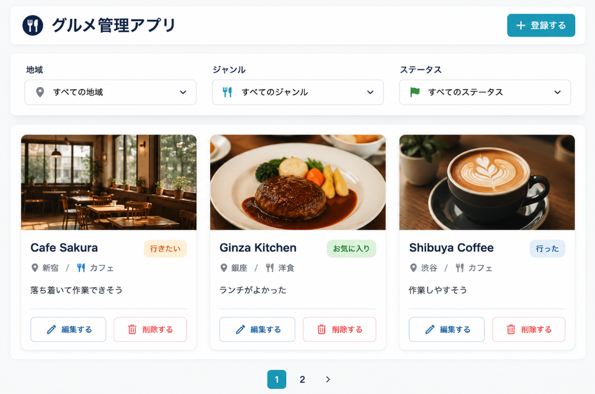
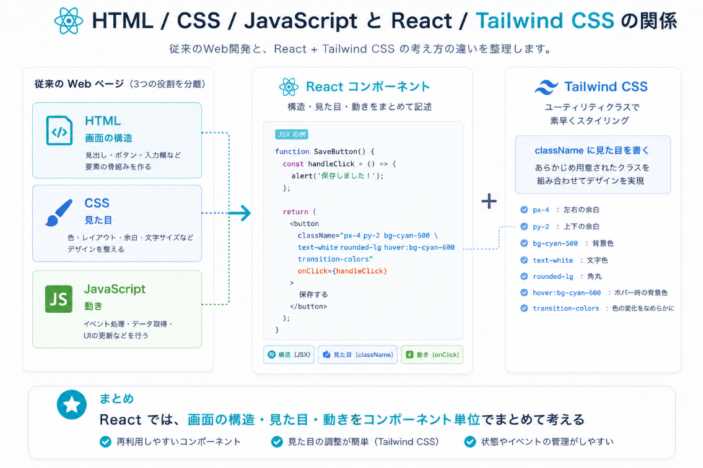
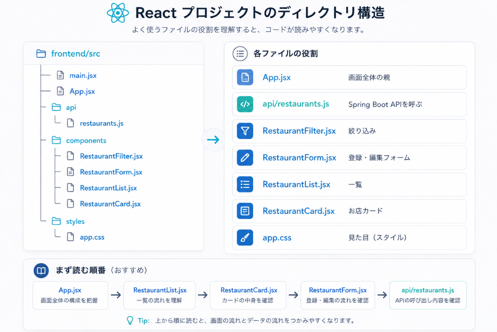
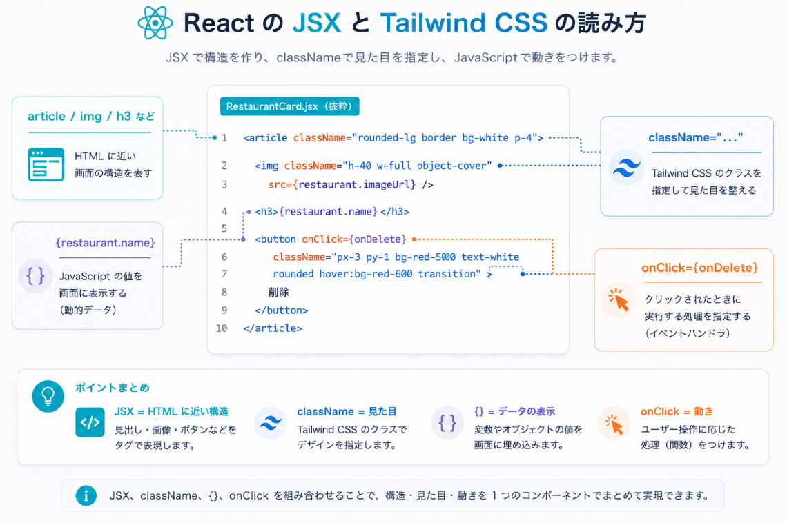
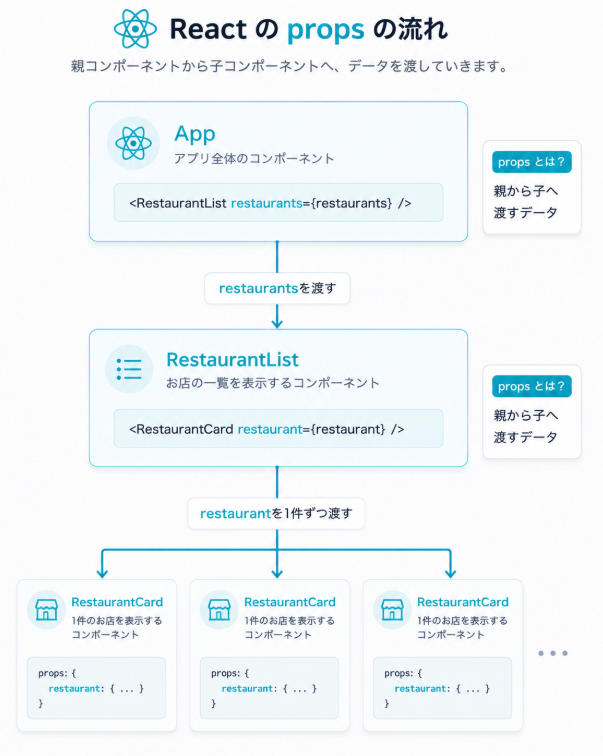
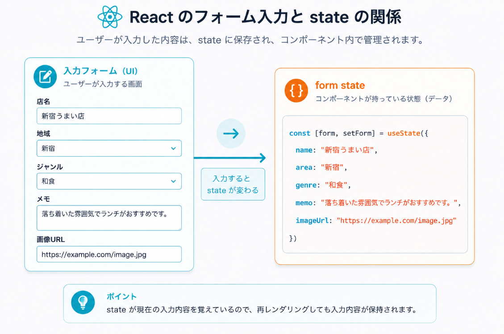
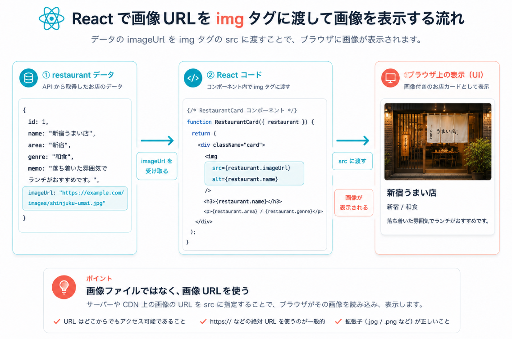

# Day 4: Reactの基本

## 今日のゴール

- Reactコンポーネントの考え方を理解する
- propsとstateの違いを理解する
- useStateとuseEffectを使える
- 画像付きのお店一覧画面を作れる
- お店登録フォームを作れる
- 生成されたReactコードをコンポーネント単位で読める

## 扱う内容

- コンポーネント
- props
- state
- useState
- useEffect
- フォーム入力
- imgタグでの画像表示
- フィルタUI

## 今日の重点

| ラベル | 重点 | 今日できるようにすること |
| --- | --- | --- |
| 🟦 概念 | JSX / Component / props / state | Reactコードを部品単位で読める |
| 🟩 実装 | Movieのカード、一覧、フォーム | 固定データで画面を作れる |
| 🟩 実装 | Tailwind CSS | `className` の見た目指定を読める |
| 🟨 確認 | ブラウザ表示 | state変更で画面が変わることを確認できる |
| 🟥 注意 | コンポーネントを大きくしすぎない | 役割ごとにファイルを分ける |

## ライブコーディングと演習

```text
ライブコーディング  MovieList / MovieCard / MovieForm
演習              RestaurantList / RestaurantCard / RestaurantForm
```

Movieで作ったコンポーネント構造を、Restaurantへ置き換えて実装します。
API接続はDay5で扱うため、Day4の演習では固定データで進めます。

## 進める順番

```text
1. Reactで作る画面の完成イメージを確認する
2. HTML、CSS、JavaScript、React、Tailwind CSSの関係を確認する
3. Reactのディレクトリ構造とコンポーネント分割を確認する
4. props、state、useStateを図で確認する
5. お店カード、一覧、フォームを段階的に実装する
6. 画像URL表示とフィルタUIを確認する
7. 演習の進め方と確認ポイントを確認する
```

Day4では、API接続を急ぎません。
固定データで画面を作り、Reactのファイル構造、props、state、Tailwind CSSの読み方をつかみます。

## 完成画面のイメージ



Day4では、この画面をいきなり全部作るのではなく、カード、一覧、フォーム、フィルタの順番で小さく作ります。
まずは固定データで画面が表示されるところを確認し、Day5でAPIと接続します。

## 今日の大事な考え方

Reactでは、画面を部品に分けて考える。

Reactは、HTML、CSS、JavaScriptを組み合わせて画面を作りやすくするものとして見ると分かりやすいです。

```text
HTML        画面の構造
CSS         見た目
JavaScript  動き
React       構造・見た目・動きをコンポーネントとしてまとめる
Tailwind CSS classNameに見た目を書く
```

今回のハンズオンでは、Tailwind CSSを使います。
CSSファイルに細かいスタイルを書き足すよりも、JSXの `className` に見た目の指定を書いていきます。



```jsx
<article className="rounded-lg border border-slate-200 bg-white p-4 shadow-sm">
  <h3 className="text-lg font-semibold text-slate-900">
    Cafe Sakura
  </h3>
</article>
```

このように、Reactでは画面構造と見た目の指定が同じコンポーネント内にまとまります。
「この部品の見た目はこのファイルを見れば分かる」と考えると追いやすくなります。

```text
App
  RestaurantFilter
  RestaurantForm
  RestaurantList
    RestaurantCard
```

stateが変わると、Reactが画面を更新する。

```text
入力する
  ↓
stateが変わる
  ↓
画面が再描画される
```

## Reactコードを読むための最低限

Day4では、Reactをすべて覚える必要はありません。
まずは、次の書き方を読めるようにします。

### Reactでまず覚える重要事項

Reactを習得するときは、最初から全部を覚えようとしない。
まずは、次の7つを読めるようにします。

| 色 | 覚えること | 役割 | コードで見る場所 |
| --- | --- | --- | --- |
| 🟦 | `JSX` | JavaScriptの中にHTMLに近い形で画面を書く | `return (...)` の中 |
| 🟩 | `Component` | 画面を部品に分ける | `MovieCard`、`MovieList`、`MovieForm` |
| 🟨 | `props` | 親から子へデータを渡す | `function MovieCard({ movie })` |
| 🟧 | `state` | 画面の中で変わるデータ | `movies`、`form`、`selectedGenre` |
| 🟥 | `useState` | stateを作る | `const [form, setForm] = useState(...)` |
| 🟪 | `useEffect` | 画面表示後に処理を実行する | `useEffect(() => { ... }, [])` |
| ⬛ | `event handler` | ユーザー操作で動く関数 | `onClick`、`onChange`、`onSubmit` |

まずこの対応を覚える:

| やりたいこと | 使うもの |
| --- | --- |
| 🟦 表示する | `JSX` / `Component` / `props` |
| 🟧 入力する | `state` / `useState` / `onChange` |
| ⬛ 操作する | `onClick` / `onSubmit` |
| 🟪 画面表示後に何かする | `useEffect` |

コードを読むときは、次の順番で見ると迷いにくいです。

```text
1. Component名を見る
   何の部品かを確認する。

2. propsを見る
   親から何を受け取っているか確認する。

3. stateを見る
   この部品の中で何が変わるか確認する。

4. event handlerを見る
   ユーザー操作で何が起きるか確認する。

5. JSXを見る
   画面に何が表示されるか確認する。
```

```text
export function MovieCard(...)
  他のファイルから使えるコンポーネントを定義している。

import { MovieCard } from "./MovieCard";
  別ファイルのコンポーネントを読み込んでいる。

return (...)
  画面に表示するJSXを返している。

props
  親から子へ渡されるデータ。

useState
  画面内で変わる値を覚える。

map
  配列を1件ずつ画面部品に変換する。

onClick / onChange / onSubmit
  ユーザー操作が起きたときに動く処理を指定する。
```

JSXはHTMLに似ていますが、JavaScriptの中に画面構造を書いています。
そのため、HTMLと違って `{movie.title}` のようにJavaScriptの値を埋め込めます。

```jsx
<h3>{movie.title}</h3>
```

読み方:

```text
<h3>
  見出しを表示するタグ。

{movie.title}
  JavaScriptの値を画面に表示する。

movie
  propsとして受け取った映画1件分のデータ。

title
  movieの中にあるタイトル。
```

JSXでよく見る書き方:

```text
className
  HTMLのclassに相当する。
  ReactではclassではなくclassNameと書く。

htmlFor
  labelとinputを関連付ける属性。
  HTMLのforに相当する。

{...}
  JavaScriptの値や式をJSXの中に埋め込む。

onClick={handleClick}
  クリックされたときにhandleClickを実行する。


  子要素を持たないタグは閉じる。
```

## 最初に伝えること

Reactでは、画面を小さな部品に分けて作る。

最初から1つの大きなファイルに全部書くと、どこが何をしているか分かりにくくなる。
そのため、グルメ管理アプリでは次のように分ける。

```text
App               全体をまとめる
RestaurantFilter  絞り込み条件を選ぶ
RestaurantForm    お店を登録・編集する
RestaurantList    お店カードを並べる
RestaurantCard    お店1件を表示する
```

AIがReactコードを生成した場合も、まずコンポーネント単位で読む。

## コンポーネントに分ける目的

ここはReactでかなり重要です。

Reactでは、画面を1つの大きなファイルに全部書くのではなく、役割ごとに小さなコンポーネントへ分けます。
コンポーネントに分ける目的は、ファイル数を増やすことではありません。
「どこに何を書くか」を決めて、コードを読みやすくするためです。

グルメ管理アプリでは、画面を次のように分けます。

```text
App
  画面全体の親。
  restaurants、form、filterなど、画面全体で使う状態を管理する。

RestaurantList
  お店の配列を受け取り、RestaurantCardを複数並べる。

RestaurantCard
  お店1件分だけを表示する。
  画像、店名、地域、ジャンル、メモ、ステータスを表示する。

RestaurantForm
  登録・編集フォームを担当する。
  入力値をstateで管理する。

RestaurantFilter
  地域、ジャンル、ステータスの絞り込み条件を担当する。
```

大事なのは、1つのコンポーネントに複数の責任を詰め込みすぎないことです。

```text
RestaurantCardは、一覧全体の並べ方を知らなくてよい。
RestaurantListは、フォーム入力の管理を知らなくてよい。
RestaurantFormは、カードの見た目を知らなくてよい。
```

役割を分けると、コードを読むときも修正するときも迷いにくくなります。

```text
カードの見た目を変えたい
  -> RestaurantCard.jsx

一覧の並べ方を変えたい
  -> RestaurantList.jsx

フォーム項目を増やしたい
  -> RestaurantForm.jsx

絞り込み条件を増やしたい
  -> RestaurantFilter.jsx

APIのURLやfetch処理を変えたい
  -> api/restaurants.js
```

AIが生成したReactコードを見るときも、まず「このコンポーネントは何を担当しているか」を確認します。
動くかどうかだけでなく、役割が混ざりすぎていないかを見ることが大事です。

## コンポーネント分割の確認観点

Reactを書くときは、動いたあとに「適切にコンポーネントへ分けられているか」を確認します。
分けること自体が目的ではなく、役割が読みやすくなっているかを見ます。

```text
App.jsx
  画面全体で使うstateを持っているか。
  子コンポーネントへ必要なpropsを渡しているか。

RestaurantList.jsx
  restaurants配列を受け取って、mapでRestaurantCardを並べているか。
  1件分のカードの見た目を書きすぎていないか。

RestaurantCard.jsx
  restaurant 1件分の表示だけを担当しているか。
  一覧全体のstateやフォーム入力を持っていないか。

RestaurantForm.jsx
  入力フォームとform stateを担当しているか。
  一覧カードの見た目を書いていないか。

RestaurantFilter.jsx
  絞り込み条件の選択だけを担当しているか。
  一覧データの表示まで抱え込んでいないか。
```

迷ったときは、次の質問で確認します。

```text
このコンポーネントは何を担当しているか。
このコンポーネントが知らなくてよい情報を持っていないか。
同じ表示や処理が別の場所に重複していないか。
propsで渡せばよいデータを、別の場所で作り直していないか。
```

よくない分け方の例:

```text
RestaurantCardの中で、一覧全体のfilter stateを持つ。
RestaurantListの中に、登録フォームの入力処理を書く。
App.jsxに、カード1件分の細かいHTMLを全部書く。
```

よい分け方の目安:

```text
App.jsx
  全体の状態と、子コンポーネントの組み合わせを担当する。

RestaurantList.jsx
  配列を並べることだけを担当する。

RestaurantCard.jsx
  1件分の表示だけを担当する。

RestaurantForm.jsx
  入力と送信だけを担当する。
```

## Reactのディレクトリ構造

React側は `frontend/` に作ります。

画面を部品ごとに分けるため、`components/` にコンポーネントを置きます。
APIを呼ぶ処理は `api/` にまとめます。
Tailwind CSSを使うため、見た目の多くは各コンポーネントの `className` に書きます。

```text
frontend/
└─ src/
   ├─ main.jsx
   ├─ App.jsx
   ├─ api/
   │  └─ restaurants.js
   ├─ components/
   │  ├─ RestaurantFilter.jsx
   │  ├─ RestaurantForm.jsx
   │  ├─ RestaurantList.jsx
   │  └─ RestaurantCard.jsx
   └─ styles/
      └─ app.css
```

それぞれの役割:

```text
main.jsx                 Reactアプリの起動入口
App.jsx                  画面全体の親コンポーネント
api/restaurants.js       Spring Boot APIを呼ぶ関数
RestaurantFilter.jsx     地域・ジャンル・ステータスの絞り込み
RestaurantForm.jsx       お店の登録・編集フォーム
RestaurantList.jsx       お店カードを並べる
RestaurantCard.jsx       お店1件を表示する
app.css                  全体に共通する最低限のスタイル
```

最初に読む順番:

```text
1. App.jsx
   画面全体でどのstateを持っているかを見る。
   どのコンポーネントに何を渡しているかを見る。

2. RestaurantList.jsx
   restaurants配列をどう並べているかを見る。
   RestaurantCardへ1件ずつ渡していることを見る。

3. RestaurantCard.jsx
   お店1件分をどう表示しているかを見る。
   imageUrlをimgタグに渡していることを見る。

4. RestaurantForm.jsx
   入力値をどうstateで管理しているかを見る。
   登録ボタンで何を呼ぶかを見る。

5. RestaurantFilter.jsx
   絞り込み条件をどう選ばせているかを見る。
   選択値を親へどう渡すかを見る。

6. api/restaurants.js
   Spring Boot APIをどう呼んでいるかを見る。
   API連携はDay5で詳しく扱う。
```

Reactでは、ファイルを分けることで「どの部品が何を担当しているか」を見つけやすくします。



Tailwind CSSを使う場合、コンポーネント内に次の3つがまとまりやすくなります。

```text
JSXのタグ       画面の構造
className       見た目
イベント処理     ボタンを押したときの動き
```

例:

```jsx
export function RestaurantCard({ restaurant }) {
  return (
    <article className="rounded-lg border bg-white p-4 shadow-sm">
      
      <h3 className="mt-3 text-lg font-semibold">
        {restaurant.name}
      </h3>
      <p className="text-sm text-slate-600">
        {restaurant.area} / {restaurant.genre}
      </p>
    </article>
  );
}
```

見るポイント:

- `<article>` や `` はHTMLに近い画面構造
- `className` はTailwind CSSで見た目を指定している
- `{restaurant.name}` はJavaScriptの値を画面に表示している



## propsとstate

Reactで最初に混乱しやすいのが、propsとstate。

### props

親コンポーネントから子コンポーネントへ渡すデータ。

```text
App
  ↓ restaurantを渡す
RestaurantCard
```

子コンポーネントは、受け取ったpropsを使って表示する。



### state

画面の中で変化する値。

例えば次のようなもの。

```text
restaurants      お店一覧
form             入力フォームの値
selectedArea     選択中の地域
selectedGenre    選択中のジャンル
selectedStatus   選択中のステータス
```

stateが変わると、Reactは画面を更新する。

## useState

useStateは、画面で変わる値を覚えるために使う。

```jsx
const [selectedArea, setSelectedArea] = useState("すべて");
```

読み方:

```text
selectedArea     現在の値
setSelectedArea  値を変更する関数
"すべて"          最初の値
```

地域フィルタを変更したら、`setSelectedArea` を呼ぶ。
すると `selectedArea` が変わり、画面に表示するお店も変わる。

フォーム入力も同じ考え方です。
入力欄の値をstateに保存しておくことで、登録ボタンを押したときに現在の入力内容をAPIへ渡せるようになります。



Reactのフォームでは、入力欄の値をstateで管理する形をよく使います。

```jsx
<input
  name="title"
  value={form.title}
  onChange={handleChange}
/>
```

読み方:

```text
name="title"
  どの入力項目かを表す名前。

value={form.title}
  入力欄に表示する値をstateから渡す。

onChange={handleChange}
  入力されたときにstateを更新する。
```

この形にすると、画面の入力値とstateの値がそろいます。
登録ボタンを押したときは、stateに入っている `form` を使って登録処理を行います。

## useEffect

useEffectは、画面表示時や値の変化時に処理を実行するために使う。

Day4では固定データで進めるため、useEffectは深追いしすぎない。
Day5でAPI呼び出しとセットで理解する。

```jsx
useEffect(() => {
  // 画面表示時に実行したい処理
}, []);
```

## 画像表示

画像URLは文字列として受け取る。
Reactでは、そのURLを `img` タグの `src` に指定する。

```jsx

```

ここで重要なのは、Reactが画像ファイルを持っているわけではないこと。
ReactはURLを使って、ブラウザに画像を表示させている。



画像表示の流れ:

```text
restaurants state
  ↓
RestaurantList
  ↓
RestaurantCard
  ↓

```

## ライブコーディング: Movie画面

ここからは、説明者がMovie題材でReact画面を作ります。
参加者は、コンポーネントをどう分けるか、propsとstateがどこで使われるかを見ながら確認します。

固定データを使って一覧画面と登録フォームを作成します。

画面に表示する項目:

- 画像
- タイトル
- ジャンル
- ステータス
- メモ

フォームで入力する項目:

- タイトル
- ジャンル
- メモ
- 画像URL
- ステータス

## 説明者用: ライブコーディングで作るもの

ライブコーディングでは、完成コードを一気に貼るのではなく、次の順番で小さく作ります。
各ステップでブラウザを確認し、「今どのコンポーネントが何を担当しているか」を言葉にします。

```text
1. App.jsx
   固定のMovieデータを置く。
   まだコンポーネント分割せず、データの形だけ確認する。

2. components/MovieCard.jsx
   映画1件分を表示する。
   propsでmovieを受け取る。

3. components/MovieList.jsx
   movies配列を受け取り、mapでMovieCardを並べる。

4. components/MovieForm.jsx
   入力値をuseStateで管理する。
   送信時に親へformを渡す。

5. App.jsx
   movies stateを持つ。
   MovieFormから受け取ったmovieをmoviesへ追加する。

6. components/MovieFilter.jsx
   余裕があれば、ジャンルやステータスの選択UIを作る。
   フィルタ条件のstateはApp.jsxに置く。
```

作るファイル:

```text
frontend/src/App.jsx
frontend/src/components/MovieCard.jsx
frontend/src/components/MovieList.jsx
frontend/src/components/MovieForm.jsx
frontend/src/components/MovieFilter.jsx  余裕があれば
```

説明者が各ステップで確認すること:

```text
MovieCardを作ったあと
  1件分だけ表示できるか。
  movie.title、movie.imageUrlを読めているか。

MovieListを作ったあと
  複数件をmapで表示できるか。
  key={movie.id} が付いているか。

MovieFormを作ったあと
  入力するとform stateが変わるか。
  onSubmitで親へ値を渡しているか。

App.jsxへ登録処理を足したあと
  登録ボタンでmovies stateが増えるか。
  stateが増えると一覧表示も増えるか。

コンポーネント分割を見直すとき
  Cardが1件表示だけを担当しているか。
  Listが配列表示だけを担当しているか。
  Formが入力だけを担当しているか。
```

説明者が口頭で補足するとよいこと:

```text
Reactでは、まず小さく表示する。
表示できたら配列にする。
配列で表示できたら入力フォームを足す。
フォームで入力できたらstateを更新する。

この順番にすると、どこで壊れたか分かりやすい。
```

## 実装の進め方

Reactはファイルが分かれるため、次の順番で作ると迷いにくいです。
小さい画面部品から作り、画面に表示されたことを確認してから次へ進みます。

```text
1. App.jsxに固定データを置く
   画面に出したいデータの形を確認する

2. MovieCardを作る
   1件分だけ表示できるようにする

3. MovieListを作る
   配列をmapして複数件表示する

4. MovieFormを作る
   入力値をstateで持つ

5. 登録処理を足す
   stateを更新して画面が変わることを確認する
```

最初からフォーム、一覧、フィルタを全部同時に作ると、どこで詰まったか分かりにくくなります。
1つ動いたら、次の部品を足します。

### 1. Movieの固定データを用意する

まず `App.jsx` に映画データを直接書きます。

```jsx
const initialMovies = [
  {
    id: 1,
    title: "Inception",
    genre: "SF",
    memo: "夢の中に入っていく映画",
    imageUrl: "https://example.com/images/inception.jpg",
    status: "見た",
  },
];
```

1行ずつ読む:

```text
const initialMovies = [
  固定の映画データを配列として用意している。
  API接続前は、この配列を画面表示に使う。

{
  ここから1件分の映画データ。

id: 1
  Reactが一覧表示で1件を区別するためのID。

title: "Inception"
  映画タイトル。

genre: "SF"
  ジャンル。

memo: "夢の中に入っていく映画"
  カードに表示するメモ。

imageUrl: "https://example.com/images/inception.jpg"
  imgタグで表示する画像URL。

status: "見た"
  映画の状態。
```

この時点ではAPIを呼びません。
まず画面に出したいデータの形を確認します。

### 2. MovieCardを作る

1件分の映画を表示します。

見るポイント:

- propsで `movie` を受け取る
- `movie.title` などを画面に表示する
- `movie.imageUrl` を `img` の `src` に渡す
- `className` で見た目を整える

### 3. MovieListを作る

複数件の映画を並べます。

```jsx
export function MovieList({ movies }) {
  return (
    <div className="grid gap-4">
      {movies.map((movie) => (
        <MovieCard key={movie.id} movie={movie} />
      ))}
    </div>
  );
}
```

1行ずつ読む:

```text
export function MovieList({ movies })
  MovieListコンポーネントを定義している。
  moviesは親コンポーネントからpropsとして受け取る配列。

return (...)
  画面に表示するJSXを返す。

<div className="grid gap-4">
  映画カードを並べる外側の箱。
  classNameはTailwind CSSの見た目指定。

movies.map((movie) => (...))
  movies配列を1件ずつ取り出して、MovieCardに変換する。

<MovieCard key={movie.id} movie={movie} />
  映画1件分をMovieCardへ渡して表示する。
  keyはReactがリストの各要素を区別するために使う。
  movie={movie} で子コンポーネントへデータを渡している。
```

見るポイント:

- `movies` は配列
- `map` で1件ずつ `MovieCard` に渡す
- `key` はReactがリストを管理するために必要

### 4. MovieFormを作る

フォームの入力値をstateで管理します。

```jsx
const [form, setForm] = useState({
  title: "",
  genre: "",
  memo: "",
  imageUrl: "",
  status: "見たい",
});
```

1行ずつ読む:

```text
const [form, setForm] = useState(...)
  フォームの入力値をstateとして持つ。
  formは現在の入力値、setFormは入力値を更新する関数。

title: ""
  映画タイトルの初期値。まだ入力されていないので空文字。

genre: ""
  ジャンルの初期値。

memo: ""
  メモの初期値。

imageUrl: ""
  画像URLの初期値。

status: "見たい"
  ステータスの初期値。
```

入力欄が変わったら `setForm` でstateを更新します。

```jsx
function handleChange(event) {
  const { name, value } = event.target;
  setForm({ ...form, [name]: value });
}
```

1行ずつ読む:

```text
function handleChange(event)
  入力欄の値が変わったときに実行する関数。

const { name, value } = event.target;
  変更された入力欄のname属性と入力値を取り出す。

setForm({ ...form, [name]: value });
  既存のformをコピーし、変更された項目だけ新しい値に更新する。
  [name] と書くことで、title、genre、memoなどを共通の処理で更新できる。
```

### 5. 登録ボタンで一覧に追加する

API接続前は、stateの配列に追加します。

```jsx
setMovies([
  ...movies,
  {
    id: Date.now(),
    ...form,
  },
]);
```

1行ずつ読む:

```text
setMovies(...)
  映画一覧のstateを更新する。
  stateが変わると、Reactが画面を再描画する。

[
  新しい配列を作っている。

...movies
  既存の映画一覧をそのまま入れる。

{
  追加する新しい映画データ。

id: Date.now()
  仮のIDを作る。
  API接続後はDBで作られたIDを使う。

...form
  フォームに入力された値を新しい映画データとして展開する。
```

ここで理解したいのは、登録ボタンを押すとstateが変わり、画面が更新されることです。

### 6. MovieFilterの考え方を確認する

ジャンルやステータスの選択値をstateに持ち、表示する一覧を絞り込みます。
Day4のライブでは、絞り込みの考え方まで確認します。

```text
selectedGenreが変わる
  ↓
表示するmoviesを絞り込む
  ↓
MovieListに渡す配列が変わる
  ↓
画面が更新される
```

### 7. 編集・削除ボタンの考え方を確認する

カードに編集・削除ボタンを置く場合、カード自身が一覧全体を変更するのではありません。
カードは「この映画を編集したい」「この映画を削除したい」と親へ伝えます。

```jsx
export function MovieCard({ movie, onEdit, onDelete }) {
  return (
    <article>
      <h3>{movie.title}</h3>
      <button type="button" onClick={() => onEdit(movie)}>
        編集
      </button>
      <button type="button" onClick={() => onDelete(movie.id)}>
        削除
      </button>
    </article>
  );
}
```

1行ずつ読む:

```text
onEdit
  親コンポーネントから受け取る関数。
  編集ボタンを押したときに呼ぶ。

onDelete
  親コンポーネントから受け取る関数。
  削除ボタンを押したときに呼ぶ。

onClick={() => onEdit(movie)}
  クリックされたら、編集したい1件分のmovieを親へ渡す。

onClick={() => onDelete(movie.id)}
  クリックされたら、削除したいmovieのidを親へ渡す。
```

編集では、どのデータを編集中かをstateで持ちます。

```text
編集ボタンを押す
  ↓
editingMovie stateに1件分のデータを入れる
  ↓
フォームに値を表示する
  ↓
保存ボタンで一覧を更新する
```

ライブコーディングで作るファイル:

```text
App.jsx
MovieCard.jsx
MovieList.jsx
MovieForm.jsx
```

## ライブコーディング用コピペコード

ライブコーディングでは、まず貼って動かしてから読みます。
その後で、どのコンポーネントが何を担当しているかを確認します。
貼るときも、できれば次の順番で小さく確認します。

```text
1. MovieCard.jsx
   1件表示の形を確認する

2. MovieList.jsx
   複数件表示の流れを確認する

3. MovieForm.jsx
   入力値をstateで持つ流れを確認する

4. App.jsx
   stateとコンポーネントのつながりを確認する
```

### components/MovieCard.jsx

```jsx
export function MovieCard({ movie }) {
  return (
    <article className="overflow-hidden rounded-lg border border-slate-200 bg-white shadow-sm">
      
      <div className="space-y-2 p-4">
        <h3 className="text-lg font-semibold text-slate-900">{movie.title}</h3>
        <p className="text-sm text-slate-600">
          {movie.genre} / {movie.status}
        </p>
        <p className="text-sm text-slate-700">{movie.memo}</p>
      </div>
    </article>
  );
}
```

### components/MovieList.jsx

```jsx
import { MovieCard } from "./MovieCard";

export function MovieList({ movies }) {
  return (
    <div className="grid gap-4 md:grid-cols-2">
      {movies.map((movie) => (
        <MovieCard key={movie.id} movie={movie} />
      ))}
    </div>
  );
}
```

### components/MovieForm.jsx

```jsx
import { useState } from "react";

const initialForm = {
  title: "",
  genre: "",
  memo: "",
  imageUrl: "",
  status: "見たい",
};

export function MovieForm({ onAddMovie }) {
  const [form, setForm] = useState(initialForm);

  function handleChange(event) {
    const { name, value } = event.target;
    setForm({ ...form, [name]: value });
  }

  function handleSubmit(event) {
    event.preventDefault();
    onAddMovie(form);
    setForm(initialForm);
  }

  return (
    <form onSubmit={handleSubmit} className="grid gap-3 rounded-lg border border-slate-200 bg-white p-4">
      <input name="title" value={form.title} onChange={handleChange} placeholder="タイトル" className="rounded border p-2" />
      <input name="genre" value={form.genre} onChange={handleChange} placeholder="ジャンル" className="rounded border p-2" />
      <input name="imageUrl" value={form.imageUrl} onChange={handleChange} placeholder="画像URL" className="rounded border p-2" />
      <textarea name="memo" value={form.memo} onChange={handleChange} placeholder="メモ" className="rounded border p-2" />
      <select name="status" value={form.status} onChange={handleChange} className="rounded border p-2">
        <option value="見たい">見たい</option>
        <option value="見た">見た</option>
        <option value="お気に入り">お気に入り</option>
      </select>
      <button className="rounded bg-cyan-600 px-4 py-2 font-semibold text-white" type="submit">
        追加する
      </button>
    </form>
  );
}
```

### App.jsx

```jsx
import { useState } from "react";
import { MovieForm } from "./components/MovieForm";
import { MovieList } from "./components/MovieList";

const initialMovies = [
  {
    id: 1,
    title: "Inception",
    genre: "SF",
    memo: "夢の中に入っていく映画",
    imageUrl: "https://example.com/images/inception.jpg",
    status: "見た",
  },
  {
    id: 2,
    title: "Iron Man",
    genre: "アクション",
    memo: "スーツを作って戦うヒーロー映画",
    imageUrl: "https://example.com/images/iron-man.jpg",
    status: "お気に入り",
  },
];

export default function App() {
  const [movies, setMovies] = useState(initialMovies);

  function handleAddMovie(movie) {
    setMovies([
      ...movies,
      {
        id: Date.now(),
        ...movie,
      },
    ]);
  }

  return (
    <main className="min-h-screen bg-slate-50 p-6">
      <div className="mx-auto grid max-w-5xl gap-6">
        <h1 className="text-2xl font-bold text-slate-900">映画メモ</h1>
        <MovieForm onAddMovie={handleAddMovie} />
        <MovieList movies={movies} />
      </div>
    </main>
  );
}
```

貼った後に見るポイント:

```text
App.jsx
  movies stateを持つ
  MovieFormへonAddMovieを渡す
  MovieListへmoviesを渡す

MovieForm.jsx
  form stateを持つ
  入力値が変わるたびにsetFormする
  送信時にonAddMovieを呼ぶ

MovieList.jsx
  movies配列をmapする
  1件ずつMovieCardへ渡す

MovieCard.jsx
  movieを受け取って1件分だけ表示する
```

特に大事な行を読む:

```text
export function MovieCard({ movie })
  MovieCardコンポーネントを定義する。
  親からmovieをpropsとして受け取る。

src={movie.imageUrl}
  movieのimageUrlをimgタグのsrcへ渡す。
  ブラウザがそのURLの画像を表示する。

{movie.title}
  JavaScriptの値を画面に表示する。

movies.map((movie) => (...))
  movies配列を1件ずつ取り出して、画面部品に変換する。

<MovieCard key={movie.id} movie={movie} />
  1件分のmovieをMovieCardへ渡す。
  keyはReactが一覧の各要素を区別するために使う。

const [form, setForm] = useState(initialForm)
  フォームの入力値をstateとして管理する。

setForm({ ...form, [name]: value })
  変更された入力欄だけを更新する。
  title、genre、memoなどを同じ処理で扱える。

onAddMovie(form)
  フォームの値を親コンポーネントへ渡す。

setMovies([...movies, { id: Date.now(), ...movie }])
  既存の映画一覧に、新しい映画を追加する。
  stateが変わるので画面が更新される。
```

## ライブコーディング後の動作確認

Day4はAPIに接続せず、React画面だけを確認します。
コードを書いたら、ブラウザで表示、Console、入力操作、state更新の順番で見ます。

### 1. Reactを起動する

VS Codeのターミナルで `frontend/` に移動し、Reactを起動します。

```bash
yarn dev
```

確認すること:

```text
ViteのURLが表示される
ブラウザで画面を開ける
画面が真っ白ではない
```

よく見るエラー:

```text
Module not found
  importのパスが間違っている可能性がある。
  ./components/MovieCard のような相対パスを確認する。

Unexpected token
  JSXの閉じタグ、括弧、カンマが抜けている可能性がある。

MovieCard is not defined
  importし忘れている可能性がある。
```

### 2. Consoleを確認する

ブラウザの開発者ツールでConsoleを開きます。

確認すること:

```text
赤いエラーが出ていない
keyに関する警告が出ていない
画像URLの読み込みエラーが大量に出ていない
```

keyの警告が出た場合:

```text
MovieList.jsx の map で key={movie.id} を付けているか確認する。
```

### 3. 画面表示を確認する

確認すること:

```text
映画カードが表示される
画像が表示される
タイトル、ジャンル、ステータス、メモが表示される
複数件のデータが縦またはグリッドで並ぶ
```

画像が表示されない場合:

```text
movie.imageUrl にURLが入っているか
imgタグの src={movie.imageUrl} になっているか
URLをブラウザで直接開けるか
```

### 4. フォーム入力を確認する

確認すること:

```text
タイトルを入力できる
ジャンルを入力できる
メモを入力できる
画像URLを入力できる
ステータスを選択できる
```

入力しても画面に文字が入らない場合:

```text
inputのnameがform stateのキーと一致しているか
value={form.title} のようにvalueが設定されているか
onChange={handleChange} が付いているか
handleChangeでsetFormしているか
```

### 5. 登録ボタンを確認する

フォームに入力して登録ボタンを押します。

確認すること:

```text
新しいMovieカードが一覧に追加される
フォームが空に戻る
Consoleにエラーが出ていない
```

ここで見る流れ:

```text
MovieFormで入力する
  ↓
form stateが変わる
  ↓
登録ボタンを押す
  ↓
onAddMovie(form)
  ↓
App.jsxのhandleAddMovie
  ↓
setMovies
  ↓
一覧が増える
```

### 6. コンポーネントの役割を確認する

動いたあとに、ファイルごとの役割を確認します。

```text
App.jsx
  movies stateを持つ。
  MovieFormとMovieListを組み合わせる。

MovieForm.jsx
  入力値を管理する。
  登録したいデータを親へ渡す。

MovieList.jsx
  movies配列をmapで並べる。

MovieCard.jsx
  Movie 1件分だけを表示する。
```

ここまで説明できれば、Day4のライブコーディングは成功です。

## 演習前に見るMovie側の例

演習では、Movieで作った構造をRestaurantへ置き換えます。
答えを先に写すのではなく、まずMovie側の名前を見て、Restaurant側の名前を自分で考えます。

```text
Card component    MovieCard
List component    MovieList
Form component    MovieForm
Array state       movies
Single prop       movie
Display keys      title, genre, memo, imageUrl, status
```

## 演習

固定データのReact画面を完成させます。

最初に作るもの:

- お店カード
- お店一覧
- 登録フォーム
- 地域フィルタ

余裕があれば追加するもの:

- ジャンルフィルタ
- ステータスフィルタ
- 画像URLが空のときの代替表示
- 削除ボタン

演習中に説明できるようにすること:

- `App.jsx` が何を管理しているか
- `RestaurantList.jsx` と `RestaurantCard.jsx` の違い
- propsで何を渡しているか
- stateが変わると画面が変わる理由
- Tailwind CSSの `className` がどこに書かれているか
- 各コンポーネントの責任が混ざりすぎていないか
- `RestaurantCard`、`RestaurantList`、`RestaurantForm` の役割を自分の言葉で説明できるか

## AIへの依頼例

Day4では、React画面を固定データで作ります。
API接続はまだ入れず、コンポーネント分割、props、stateを確認します。

まずは、Movieで見た構造をRestaurantへ置き換えるために、自分で穴埋めします。

```text
MovieCardとMovieListを参考にして、Restaurantのカードと一覧を作りたいです。
まず、下の穴埋めが正しいか確認してください。

作るファイル:
- frontend/src/components/__________.jsx
- frontend/src/components/__________.jsx

条件:
- Cardコンポーネントはpropsとして ______ を受け取る
- 表示する項目は ______
- imageUrlは ______ タグの ______ に渡す
- Listコンポーネントは ______ 配列を受け取り、mapでCardを表示する
- API接続はまだ入れない

コードを出す前に、propsがどのように渡っているか説明してください。
また、CardとListの責任が適切に分かれているか確認してください。
```

参考にするMovie側の例:

```text
Card component    MovieCard
List component    MovieList
Single prop       movie
Array prop        movies
Display keys      title, genre, memo, imageUrl, status
```

Restaurant側のコンポーネント名、props名、表示項目は、Movieの例を見ながら自分で埋めます。

フォームの依頼例:

```text
MovieFormを参考にして、Restaurantのフォームを作りたいです。
まず、下の穴埋めが正しいか確認してください。

作るファイル:
frontend/src/components/__________.jsx

入力項目:
______, ______, ______, ______, ______, ______

条件:
- useStateで何を管理するか: ______
- 入力値が変わったら何を呼ぶか: ______
- 送信時にどのpropsへ値を渡すか: ______
- API呼び出しはまだ書かないでください

コードを出す前に、form stateがどのように更新されるか説明してください。
また、Formが一覧表示やCardの見た目まで担当していないか確認してください。
```

AIの回答を確認するときのポイント:

- API接続が勝手に入っていないか
- コンポーネントが大きくなりすぎていないか
- 1つのコンポーネントに複数の責任が混ざっていないか
- `App.jsx` が全体のstate、`List` が配列表示、`Card` が1件表示、`Form` が入力を担当しているか
- propsとstateの役割が分かれているか
- `className` にTailwind CSSの指定が書かれているか
- `img` の `src` に `restaurant.imageUrl` を渡しているか

## コードサンプル

お店1件を表示するコンポーネント。

```jsx
export function RestaurantCard({ restaurant }) {
  return (
    <article className="rounded-lg border bg-white p-4 shadow-sm">
      
      <h3 className="mt-3 text-lg font-semibold">{restaurant.name}</h3>
      <p className="text-sm text-slate-600">
        {restaurant.area} / {restaurant.genre}
      </p>
      <p className="mt-2 text-sm">{restaurant.memo}</p>
      <span className="mt-3 inline-block rounded bg-slate-100 px-2 py-1 text-xs">
        {restaurant.status}
      </span>
    </article>
  );
}
```

見るポイント:

- `restaurant` はpropsとして受け取っている
- `imageUrl` を `img` の `src` に入れている
- `className` にTailwind CSSのクラスを書いて見た目を整えている
- このコンポーネントは1件分の表示だけを担当する

1行ずつ読む:

```text
export function RestaurantCard({ restaurant })
  お店1件分を表示するコンポーネント。
  restaurantは親からpropsとして受け取る。

return (...)
  画面に表示するJSXを返す。

<article className="...">
  お店カード全体の箱。
  classNameで枠線、背景、余白、影を指定している。


  お店画像を表示する。

className="h-40 w-full rounded object-cover"
  画像の高さ、幅、角丸、トリミング方法を指定している。

src={restaurant.imageUrl}
  画像URLをimgタグに渡している。

alt={restaurant.name}
  画像の代替テキスト。店名を入れている。

<h3>{restaurant.name}</h3>
  店名を表示する。

{restaurant.area} / {restaurant.genre}
  地域とジャンルを表示する。

{restaurant.memo}
  メモを表示する。

{restaurant.status}
  ステータスを表示する。
```

## 今日の確認ポイント

- コンポーネントを分ける理由を説明できる
- `App.jsx`、`RestaurantList.jsx`、`RestaurantCard.jsx`、`RestaurantForm.jsx` の役割を説明できる
- 1つのコンポーネントに複数の責任が混ざっていないか確認できる
- propsは親から子へ渡すデータだと説明できる
- stateは画面内で変わる値だと説明できる
- `useState` の基本的な読み方が分かる
- 画像URLを `img` タグで表示できる

## よくある混乱

### propsとstateはどちらもデータですか

どちらもデータだが、役割が違う。

propsは外から受け取るデータ。
stateはコンポーネントの中で変化するデータ。

### stateを直接書き換えていいですか

直接書き換えない。

Reactでは、stateを変更する関数を使う。

```jsx
setSelectedArea("新宿");
```

### 画像URLが間違っていたらどうなりますか

画像が表示されない。

APIやReactの処理が正しくても、URL先の画像が存在しなければ表示できない。
そのため、教材では動作確認済みのサンプル画像URLを用意する。

## メモ

最初からAPI接続まで入れると混乱しやすいので、React単体で画面の考え方をつかむ。
