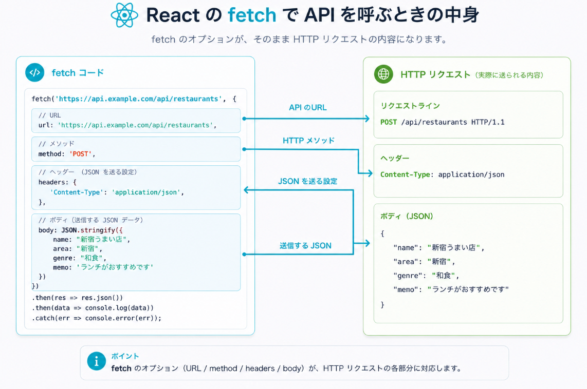
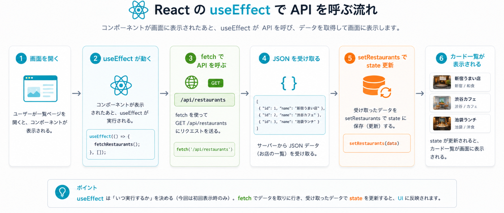
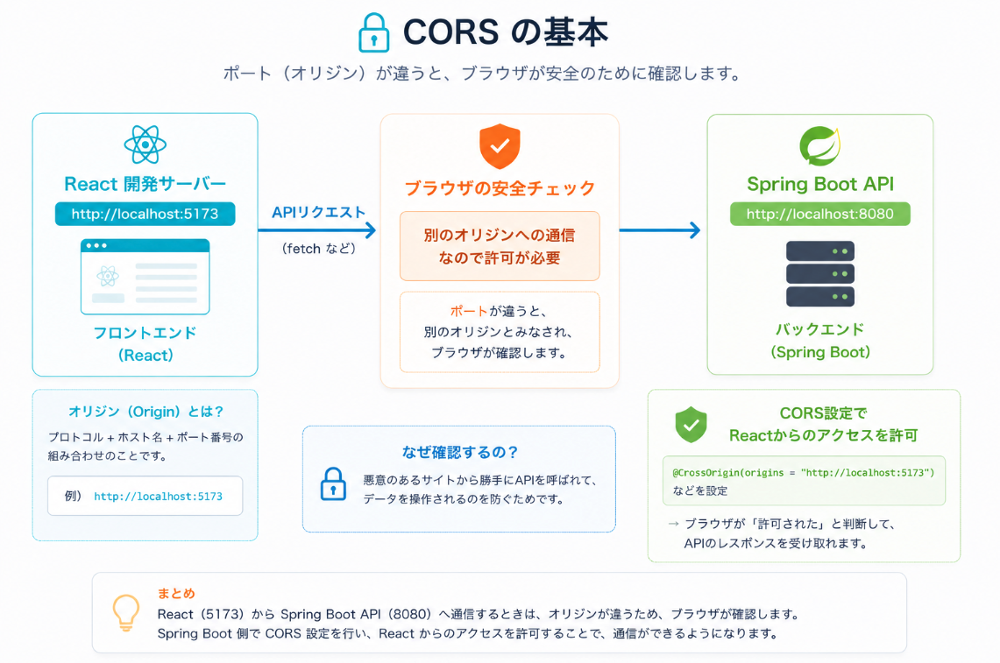

# Day 5: ReactとAPI連携

## 今日のゴール

- ReactからSpring Boot APIを呼び出せる
- 一覧表示、登録、更新、削除の流れをつなげられる
- フロントエンドとバックエンドを分けて考えられる
- 地域・ジャンル・ステータスで絞り込める
- 画像URLを使って画像を表示できる
- 1週間の内容を自分の言葉で説明できる
- AIが作った実装を見て、画面からAPIまでの流れを追える

## 扱う内容

- fetchまたはaxios
- API呼び出し
- ローディング状態
- エラー表示
- CORS
- フィルタ
- 編集
- 削除
- まとめ

## 3時間講義の流れ

```text
00:00-00:20  Day3のAPIとDay4のReact画面を復習する
00:20-00:50  fetchの中身とHTTPリクエストの対応を確認する
00:50-01:20  useEffectで一覧APIを呼ぶ流れを確認する
01:20-01:50  CORSとNetworkタブの見方を確認する
01:50-02:35  一覧、登録、削除のAPI接続をライブ実装する
02:35-02:50  編集、フィルタ、エラー表示のつなぎ方を確認する
02:50-03:00  演習の進め方と完成チェックを共有する
```

Day5では、画面とAPIを一気に全部つなげません。
まず一覧取得だけをつなぎ、Networkで確認してから登録、削除、編集、フィルタへ進みます。

## 今日の大事な考え方

フロントエンドとバックエンドは、APIでつながる。

```text
Reactのボタンを押す
  ↓
fetchでAPIを呼ぶ
  ↓
Spring Bootが処理する
  ↓
DBを更新する
  ↓
JSONを返す
  ↓
Reactがstateを更新する
  ↓
画面が変わる
```

## 最初に伝えること

Day5では、これまで別々に作ってきたReactとSpring Bootをつなげる。

ここで重要なのは、ReactとSpring Bootの責務を混ぜないこと。

```text
React
  画面を表示する
  入力を受け取る
  APIを呼ぶ
  APIの結果で画面を更新する

Spring Boot
  APIを受け取る
  処理する
  DBへ保存・取得する
  JSONを返す
```

ReactはDBを直接触らない。
Spring Bootは画面を直接描画しない。
両者はAPIでつながる。

## API呼び出しの基本

ReactからAPIを呼ぶには `fetch` を使う。

一覧取得の例:

```jsx
export async function fetchRestaurants() {
  const response = await fetch("http://localhost:8080/api/restaurants");
  return response.json();
}
```

登録の例:

```jsx
export async function createRestaurant(restaurant) {
  const response = await fetch("http://localhost:8080/api/restaurants", {
    method: "POST",
    headers: {
      "Content-Type": "application/json",
    },
    body: JSON.stringify(restaurant),
  });

  return response.json();
}
```

見るポイント:

- `method` でHTTPメソッドを指定する
- JSONを送るときは `Content-Type` を指定する
- JavaScriptのオブジェクトは `JSON.stringify` でJSON文字列にする
- APIの結果は `response.json()` で取り出す



## useEffectで一覧を取得する

画面を開いたときに一覧を取得する。

```jsx
useEffect(() => {
  async function loadRestaurants() {
    const data = await fetchRestaurants();
    setRestaurants(data);
  }

  loadRestaurants();
}, []);
```

流れ:

```text
画面を開く
  ↓
useEffectが動く
  ↓
GET /api/restaurants を呼ぶ
  ↓
JSONを受け取る
  ↓
setRestaurantsでstateを更新する
  ↓
お店一覧が表示される
```



## CORS

ReactとSpring Bootを別々のポートで動かすと、ブラウザが通信を止めることがある。

例:

```text
React        http://localhost:5173
Spring Boot  http://localhost:8080
```

このようにオリジンが違う場合、Spring Boot側でReactからのアクセスを許可する必要がある。

CORSは、まず「ブラウザの安全機能」と考える。
エラーが出たら、ReactのコードだけでなくSpring Boot側の設定も確認する。



## 画面操作とAPIの対応

```text
一覧表示  GET    /api/restaurants
登録      POST   /api/restaurants
編集      PUT    /api/restaurants/{id}
削除      DELETE /api/restaurants/{id}
```

## ハンズオン

React画面とSpring Boot APIを接続し、ミニアプリとして完成させる。

完成ライン:

- お店を登録できる
- お店一覧を見られる
- 画像を表示できる
- お店を編集できる
- お店を削除できる
- 地域で絞り込める
- ジャンルで絞り込める
- ステータスで絞り込める

## 実装の進め方

ReactとSpring Bootをつなぐときは、1つずつ確認します。

### 1. API呼び出し用のファイルを作る

APIを呼ぶ処理は `frontend/src/api/restaurants.js` にまとめます。

```jsx
const API_BASE_URL = "http://localhost:8080/api/restaurants";

export async function fetchRestaurants() {
  const response = await fetch(API_BASE_URL);
  return response.json();
}
```

見るポイント:

- Reactコンポーネントの中にURLを何度も書かない
- APIを呼ぶ関数は `api/` にまとめる
- 画面側は `fetchRestaurants()` を呼ぶだけにする

### 2. 一覧取得だけをつなぐ

最初に固定データをやめて、APIから取得したデータをstateに入れます。

```jsx
useEffect(() => {
  async function loadRestaurants() {
    const data = await fetchRestaurants();
    setRestaurants(data);
  }

  loadRestaurants();
}, []);
```

確認すること:

- Networkで `GET /api/restaurants` が呼ばれている
- レスポンスJSONにお店データが入っている
- `setRestaurants(data)` の後に画面が表示される

### 3. 登録APIをつなぐ

フォーム送信時にPOSTします。

```jsx
export async function createRestaurant(restaurant) {
  const response = await fetch(API_BASE_URL, {
    method: "POST",
    headers: {
      "Content-Type": "application/json",
    },
    body: JSON.stringify(restaurant),
  });

  return response.json();
}
```

画面側では、登録後に一覧を再取得するか、返ってきたデータをstateに追加します。
最初は分かりやすさを優先して、登録後に一覧を再取得してもよいです。

### 4. 削除APIをつなぐ

```jsx
export async function deleteRestaurant(id) {
  await fetch(`${API_BASE_URL}/${id}`, {
    method: "DELETE",
  });
}
```

確認すること:

- DELETEのURLにIDが入っている
- 削除後に一覧から消える
- DBからも消えている

### 5. 編集APIをつなぐ

編集では、既存のお店のIDを使ってPUTします。

```text
編集ボタンを押す
  ↓
フォームに既存データを入れる
  ↓
保存ボタンを押す
  ↓
PUT /api/restaurants/{id}
  ↓
一覧を更新する
```

### 6. フィルタをAPIにつなぐ

地域で絞り込む場合は、URLにクエリパラメータを付けます。

```jsx
export async function fetchRestaurants({ area } = {}) {
  const params = new URLSearchParams();

  if (area && area !== "すべて") {
    params.set("area", area);
  }

  const query = params.toString();
  const url = query ? `${API_BASE_URL}?${query}` : API_BASE_URL;

  const response = await fetch(url);
  return response.json();
}
```

確認すること:

- Networkで `?area=新宿` が付いている
- APIレスポンスが絞り込まれている
- 画面に表示される一覧も変わる

## 演習

次の順番でReactとAPIを接続します。

```text
1. 一覧取得をAPIにつなぐ
2. 登録をAPIにつなぐ
3. 削除をAPIにつなぐ
4. 編集をAPIにつなぐ
5. 地域フィルタをAPIにつなぐ
6. ジャンル、ステータスのフィルタを追加する
```

各機能で確認すること:

- どのボタンや画面操作から始まるか
- どのAPI関数を呼んでいるか
- HTTPメソッドは何か
- Networkでリクエストを確認できるか
- レスポンスJSONをstateに反映しているか
- 画面表示が変わっているか

## 動作確認の順番

フルスタック開発では、いきなり全部つなげて確認しない。

次の順番で確認すると、エラーの場所を見つけやすい。

```text
1. Spring Boot単体でAPIを確認する
2. React単体で固定データ表示を確認する
3. Reactから一覧APIを呼ぶ
4. 登録APIをつなぐ
5. 編集APIをつなぐ
6. 削除APIをつなぐ
7. フィルタをつなぐ
```

一気に全部やると、どこで壊れているか分からなくなる。

## エラー切り分け

画面がうまく動かないときは、次の順番で見る。

```text
1. ブラウザのConsole
   JavaScriptエラーが出ていないか

2. ブラウザのNetwork
   APIが呼ばれているか
   URLは正しいか
   ステータスコードは何か
   レスポンスは何か

3. Spring Bootのログ
   例外が出ていないか
   Controllerに届いているか

4. DB
   データが保存されているか
```

最初は「まずNetworkを見る」習慣をつけてもらうとよい。

## 今日の確認ポイント

- ReactからSpring Boot APIを呼ぶ流れを説明できる
- `GET`、`POST`、`PUT`、`DELETE` がReactのどの操作に対応するか説明できる
- APIの結果でstateを更新し、画面が変わることを説明できる
- CORSエラーが出たときに、何が起きているか大まかに説明できる
- エラー時にConsole、Network、Spring Bootログを見る順番が分かる

## よくある混乱

### APIは呼べているのに画面が変わりません

APIの結果をstateに入れていない可能性がある。

Reactでは、データを取得しただけでは画面は変わらない。
`setRestaurants` のようなstate更新が必要。

### Spring Bootでは成功しているのにReactでエラーになります

CORS、URL間違い、JSONの形の違い、React側の処理ミスが考えられる。

Networkタブで、実際にどんなレスポンスが返っているか確認する。

### 画像だけ表示されません

`imageUrl` の値を確認する。

APIレスポンスに `imageUrl` が含まれているか、URL先の画像が存在するかを見る。

## メモ

最後は「自分で1項目追加してみる」など、小さな応用課題を入れる。
